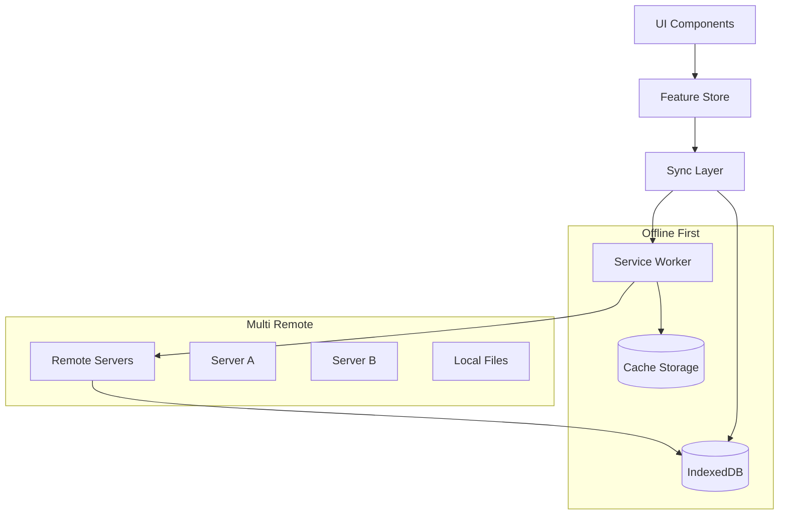

# Modular Architecture Roadmap: Feature-Based PWA with Offline-First Design

## Executive Summary

This document synthesizes the current codebase structure with the vision for a modular, offline-first PWA music application. The goal is to refactor from the current monolithic `freqhole` view into discrete, versioned feature packages that can be composed together while maintaining clear separation of concerns.

## Current State Analysis

### Existing Structure

```
client/js/src/
├── views/freqhole/          # Monolithic music app
│   ├── components/          # UI components (tightly coupled)
│   ├── context/            # Global state management
│   ├── hooks/              # Feature-specific hooks
│   ├── routes/             # Routing logic
│   ├── services/           # API integration
│   └── store/              # State management
├── lib/                    # Shared utilities
│   ├── music/              # Music domain logic
│   ├── analytics/          # Analytics features
│   └── api-client.ts       # Server communication
└── components/             # Shared UI components
```

### Pain Points Identified

1. **Tight Coupling**: Components, state, and business logic are intermingled
2. **Duplication**: Multiple similar abstractions for data loading and virtualized lists
3. **No Offline Strategy**: Limited IndexedDB usage, no service worker implementation
4. **Single Remote**: No architecture for multiple remote servers
5. **Monolithic Bundles**: No feature-based code splitting

## Target Architecture: Feature Packages

### Core Architectural Principles

1. **Feature-Based Modularity**: Each feature is a self-contained package with its own state, UI, and business logic
2. **Offline-First**: All features work without network connectivity
3. **Multi-Remote**: Support for multiple heterogeneous music servers
4. **Progressive Loading**: Lazy-load features and data as needed
5. **Type Safety**: Zod-based schemas for all data models and API contracts

### Package Structure

```
packages/
├── core/                   # Foundation layer
│   ├── storage/           # IndexedDB & cache management
│   ├── remotes/           # Multi-server abstraction
│   ├── sync/              # Data synchronization
│   └── types/             # Shared type definitions
├── features/              # Feature packages
│   ├── audio-player/      # Audio playback engine
│   ├── collections/       # Music collection management
│   ├── playlists/         # Playlist functionality
│   ├── search/            # Search and filtering
│   ├── analytics/         # Usage analytics
│   └── social/            # Social features (feeds, sharing)
├── ui/                    # Shared UI system
│   ├── components/        # Reusable components
│   ├── virtualization/    # Virtual scrolling
│   └── themes/            # Theming system
└── app/                   # Application shell
    ├── shell/             # App initialization
    ├── routing/           # Navigation
    └── composition/       # Feature orchestration
```

## Implementation Roadmap

### Phase 1: Foundation Layer (Weeks 1-3)

#### 1.1 Core Storage System

**Goal**: Replace ad-hoc data management with structured IndexedDB layer

```typescript
// packages/core/storage/src/index.ts
export interface StorageProvider {
  get<T>(key: string): Promise<T | null>;
  set<T>(key: string, value: T): Promise<void>;
  delete(key: string): Promise<void>;
  query<T>(table: string, index?: string, range?: IDBKeyRange): Promise<T[]>;
}

export interface RemoteMetadata {
  id: string;
  name: string;
  baseUrl: string;
  capabilities: string[];
  lastSync: Date;
  syncStrategy: "full" | "incremental" | "manual";
}
```

**Key Deliverables**:

- [ ] Typed IndexedDB wrapper with migrations
- [ ] Schema versioning and upgrade system
- [ ] Remote-aware data partitioning
- [ ] Offline-first caching strategies
- [ ] Data eviction policies

#### 1.2 Multi-Remote Architecture

**Goal**: Enable connecting to multiple music servers with different capabilities

```typescript
// packages/core/remotes/src/types.ts
export interface RemoteCapabilities {
  features: ("search" | "playlists" | "analytics" | "social")[];
  dataTypes: ("songs" | "albums" | "artists" | "genres")[];
  auth: "none" | "basic" | "oauth" | "custom";
  streaming: boolean;
  upload: boolean;
}

export interface RemoteAdapter {
  id: string;
  connect(config: RemoteConfig): Promise<void>;
  sync(strategy: SyncStrategy): Promise<SyncResult>;
  query<T>(endpoint: string, params?: any): Promise<T>;
}
```

**Key Deliverables**:

- [ ] Remote registration and discovery system
- [ ] Adapter pattern for different server types
- [ ] Capability negotiation and feature gating
- [ ] Connection health monitoring
- [ ] Fallback and retry strategies

#### 1.3 Service Worker & Caching

**Goal**: Implement robust offline-first caching strategy

```typescript
// packages/core/sync/src/service-worker.ts
export interface CacheStrategy {
  audio: "cache-first" | "network-first" | "stale-while-revalidate";
  images: "cache-first" | "network-first" | "stale-while-revalidate";
  api: "cache-first" | "network-first" | "stale-while-revalidate";
  metadata: "cache-first" | "network-first" | "stale-while-revalidate";
}
```

**Key Deliverables**:

- [ ] Service worker with Workbox integration
- [ ] Background sync for mutations
- [ ] Range request handling for audio
- [ ] Cache invalidation strategies
- [ ] Offline fallback UI

### Phase 2: Feature Packages (Weeks 4-8)

#### 2.1 Audio Player Package

**Goal**: Self-contained audio playback with queue management

```typescript
// packages/features/audio-player/src/index.ts
export interface AudioPlayerFeature {
  // Core playback
  play(track: Track): Promise<void>;
  pause(): void;
  seek(position: number): void;

  // Queue management
  queue: {
    add(tracks: Track[]): void;
    remove(index: number): void;
    reorder(from: number, to: number): void;
    clear(): void;
  };

  // Media session integration
  mediaSession: {
    updateMetadata(track: Track): void;
    setActionHandlers(): void;
  };

  // State
  state: Accessor<PlayerState>;
  currentTrack: Accessor<Track | null>;
  position: Accessor<number>;
  duration: Accessor<number>;
}
```

**Key Deliverables**:

- [ ] Core audio engine with HTML5 Audio
- [ ] Queue management with persistence
- [ ] Media Session API integration
- [ ] Crossfade and gapless playback
- [ ] Audio visualization hooks

#### 2.2 Collections Package

**Goal**: Unified collection management with virtualized rendering

```typescript
// packages/features/collections/src/index.ts
export interface CollectionProvider<T> {
  // Data access
  getAll(options?: QueryOptions): Promise<T[]>;
  getByPage(page: number, size: number): Promise<T[]>;
  search(query: string, filters?: Filter[]): Promise<T[]>;

  // Mutations
  add(items: T[]): Promise<void>;
  update(id: string, changes: Partial<T>): Promise<void>;
  delete(ids: string[]): Promise<void>;

  // Reactivity
  subscribe(callback: (change: CollectionChange<T>) => void): () => void;

  // Virtualization support
  getEstimatedSize(): number;
  getItemAt(index: number): Promise<T | null>;
}
```

**Key Deliverables**:

- [ ] Generic collection provider interface
- [ ] Album collection with track ordering preservation
- [ ] Artist and genre collections with aggregation
- [ ] Virtual scrolling with dynamic loading
- [ ] Search and filtering with facets
- [ ] Sort persistence and restoration

#### 2.3 Playlists Package

**Goal**: User-created and managed playlists with collaboration features

```typescript
// packages/features/playlists/src/index.ts
export interface PlaylistFeature {
  // CRUD operations
  create(playlist: CreatePlaylistRequest): Promise<Playlist>;
  update(id: string, changes: Partial<Playlist>): Promise<void>;
  delete(id: string): Promise<void>;

  // Track management
  addTracks(playlistId: string, trackIds: string[]): Promise<void>;
  removeTracks(playlistId: string, trackIds: string[]): Promise<void>;
  reorderTracks(
    playlistId: string,
    fromIndex: number,
    toIndex: number,
  ): Promise<void>;

  // Collaboration (if supported by remote)
  share(playlistId: string, permissions: SharePermissions): Promise<string>;
  collaborate(playlistId: string, users: string[]): Promise<void>;
}
```

### Phase 3: Advanced Features (Weeks 9-12)

#### 3.1 Search & Discovery

- [ ] Full-text search with ranking
- [ ] Faceted search with filters
- [ ] Search history and suggestions
- [ ] Smart collections and auto-playlists

#### 3.2 Analytics & Insights

- [ ] Play history tracking
- [ ] Listening statistics
- [ ] Music discovery recommendations
- [ ] Export and privacy controls

#### 3.3 Social Features

- [ ] Activity feeds (current feed analytics)
- [ ] Playlist sharing
- [ ] User profiles and following
- [ ] Comments and reactions

## Technical Deep Dive

### Data Flow Architecture



### State Management Pattern

Each package uses Solid.js stores with the following pattern:

```typescript
// packages/features/collections/src/store.ts
export function createCollectionStore<T>(
  provider: CollectionProvider<T>,
  options: StoreOptions = {},
) {
  const [items, setItems] = createStore<T[]>([]);
  const [loading, setLoading] = createSignal(false);
  const [error, setError] = createSignal<Error | null>(null);

  // SWR pattern with IndexedDB backing
  const [data] = createResource(
    () => provider.cacheKey,
    async (key) => {
      const cached = await provider.getCached(key);
      if (cached && !provider.isStale(cached)) return cached;

      // Return stale immediately, fetch fresh in background
      setTimeout(async () => {
        try {
          const fresh = await provider.fetchFresh(key);
          await provider.updateCache(key, fresh);
          setItems(fresh);
        } catch (err) {
          setError(err as Error);
        }
      }, 0);

      return cached || [];
    },
  );

  return {
    items: () => data() || [],
    loading,
    error,
    // ... mutations
  };
}
```

### Virtualization Strategy

Building on existing patterns but with better abstraction:

```typescript
// packages/ui/virtualization/src/index.ts
export function createVirtualCollection<T>(
  provider: CollectionProvider<T>,
  containerRef: Accessor<HTMLElement | undefined>,
  options: VirtualizationOptions<T>,
) {
  const virtualizer = createVirtualizer({
    count: () => provider.totalCount(),
    getScrollElement: containerRef,
    estimateSize: options.estimateSize,
    overscan: options.overscan || 10,
  });

  // Lazy loading with intersection observer
  const loadMoreTrigger = createIntersectionObserver(
    () => [virtualizer.getVirtualItems().at(-1)?.element],
    ([entry]) => {
      if (entry?.isIntersecting) {
        provider.loadMore();
      }
    },
  );

  return {
    virtualizer,
    items: () => virtualizer.getVirtualItems(),
    totalSize: () => virtualizer.getTotalSize(),
  };
}
```

## Migration Strategy

### Step 1: Extract Core (Week 1)

1. Move `lib/api-client.ts` → `packages/core/remotes/`
2. Create IndexedDB abstraction in `packages/core/storage/`
3. Implement service worker in `packages/core/sync/`

### Step 2: Feature Extraction (Weeks 2-4)

1. Extract audio player from `freqhole/components/player/`
2. Extract collections logic from `freqhole/hooks/`
3. Create playlist package from existing playlist components

### Step 3: UI System (Week 5)

1. Extract reusable components to `packages/ui/components/`
2. Create virtualization package
3. Implement theming system

### Step 4: Application Shell (Week 6)

1. Create new app shell that composes features
2. Implement feature-based routing
3. Add feature toggle system

### Step 5: Migration Testing (Weeks 7-8)

1. Side-by-side comparison with existing app
2. Performance benchmarking
3. User acceptance testing
4. Migration tooling for existing data

## Open Questions & Considerations

### Architecture Decisions

1. **Package Manager**: Should features be npm packages or workspace packages?
2. **Bundle Strategy**: One bundle per feature or smart splitting?
3. **Version Management**: How to handle breaking changes between features?
4. **Configuration**: How should features declare their configuration needs?

### Data Modeling

1. **Schema Evolution**: How to handle data migrations across remotes?
2. **Conflict Resolution**: What happens when multiple remotes have conflicting data?
3. **Sync Strategies**: Should sync be per-feature or application-wide?
4. **Privacy**: How to handle sensitive data across different remotes?

### Performance Considerations

1. **Memory Management**: How to prevent memory leaks in long-running sessions?
2. **Cache Sizing**: How to balance storage usage vs. performance?
3. **Background Processing**: What operations can be moved to web workers?
4. **Network Efficiency**: How to minimize bandwidth usage?

### User Experience

1. **Progressive Enhancement**: How to gracefully handle missing features?
2. **Onboarding**: How to guide users through multi-remote setup?
3. **Error Recovery**: How to handle and recover from various failure modes?
4. **Accessibility**: How to ensure all features are accessible?

## Conclusion

This modular architecture provides a clear path from the current monolithic structure to a feature-rich, offline-first PWA. The package-based approach enables:

- **Independent Development**: Teams can work on features without conflicts
- **Progressive Enhancement**: Features can be enabled/disabled based on remote capabilities
- **Better Testing**: Each package can be tested in isolation
- **Performance**: Lazy loading and code splitting by feature
- **Maintainability**: Clear boundaries and reduced coupling

The migration can be done incrementally, allowing the current app to continue functioning while new architecture is developed and tested alongside it.
