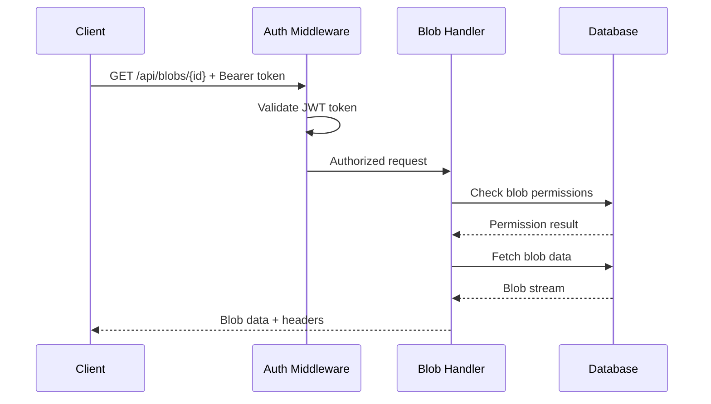
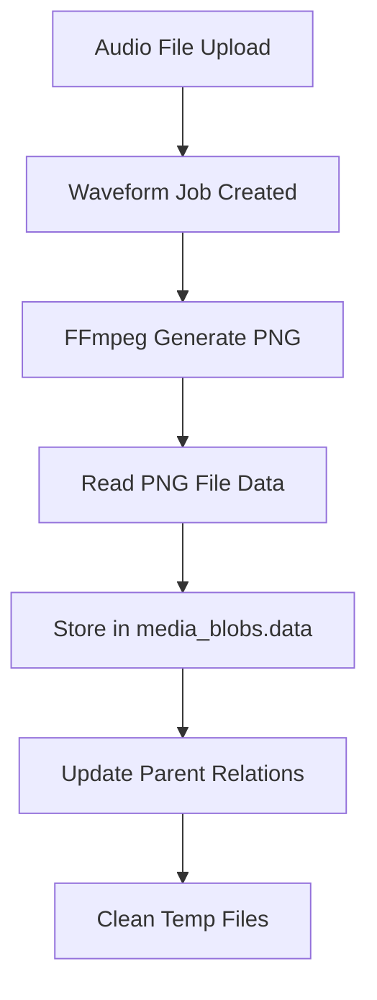

# System Improvements - Next Phase Plan

## Overview

This document outlines system improvements focusing on performance optimization, code organization, API enhancement, and bug fixes. See [system-improvements-completed.md](./system-improvements-completed.md) for detailed information on completed tasks.

## ✅ Completed Tasks (Summary)

- **A.1.1: SQLx Type Safety Migration** - Migrated 12 core queries to `sqlx::query!()`, found and fixed multiple type safety bugs
- **A.2: CLI SQL Migration** - Moved all SQL from CLI to service layer, achieved proper separation of concerns
- **B.1: Blob API Endpoint** - Implemented authenticated API for blob serving (`/api/blobs/*`)

**Status**: 3/5 high-priority tasks complete. Ready for next phase.

## Priority Issues & Improvements

### 🔥 **High Priority**

#### Issue 1: Local Path Standardization and File Storage

**Problem**: Inconsistent handling of `local_path` field for uploaded files and blob storage.

**Current Issues**:

- Upload system stores relative paths (e.g., `"uploads/abc123.jpg"`)
- Path resolution is inconsistent between upload and serving
- May cause issues with blob API serving files from filesystem
- Not using absolute system paths starting from root `/`

**Impact**:

- Blob API may fail to serve uploaded files correctly
- Inconsistent file access patterns across the system
- Potential security issues with relative path traversal
- Difficulty in file management and cleanup operations

**Solution**:

1. **Assess current path handling** - Analyze upload vs. serving discrepancies
2. **Standardize to absolute paths** - Use full system paths starting from root `/`
3. **Update upload handlers** - Ensure consistent path storage
4. **Test blob API compatibility** - Verify files can be served correctly

#### Issue 2: Blob API Integration and Enhanced File Handling

**Problem**: New blob API needs better integration with WebSocket feed and enhanced MIME type handling.

**Current Issues**:

- WebSocket feed shows media items but doesn't link to new blob API endpoints
- Blob API has basic MIME type handling, but static file system has advanced optimizations
- No shared code between blob API and enhanced static file serving
- Missing media-specific optimizations (range requests, proper headers)

**Impact**:

- Users can't easily access blob data from WebSocket feed
- Blob API provides inferior file serving compared to static files
- Code duplication between two file serving systems
- Missed opportunities for media streaming optimizations

**Solution**:

1. **Extract shared utilities** - Abstract MIME handling from `server/src/static_filez/enhanced.rs`
2. **Enhance blob API** - Add advanced media handling to blob endpoints
3. **Update WebSocket feed** - Include links to blob API endpoints in media items
4. **Add shared media optimizations** - Range requests, proper headers, streaming

#### Issue 3: Thumbnail System Extensibility & Data Persistence ⏸️ DEFERRED

**Status**: Moved to back-burner due to high complexity (see Back-Burner section below).

### 🎯 **Medium Priority**

#### Issue 4: Blob API Endpoint Missing

**Problem**: No dedicated API endpoint for serving blob data with proper authentication.

**Current State**: Static file serving works but doesn't respect blob-level permissions.

**Requirements**:

- Authenticated blob access: `GET /api/blobs/{id}`
- Proper content-type headers
- Efficient streaming for large files
- Permission checks before serving

#### Issue 5: WebSocket Feed Duplicate Rows

#### Task B.2: WebSocket Feed Deduplication

**Problem**: WebSocket feed shows duplicate entries for media items and their thumbnails on fresh page load.

**Root Cause**: Client-side filtering not properly excluding thumbnail blobs from main listing.

**Solution**: Ensure client uses proper SQL views/filters to exclude derivative blobs from main feeds.

#### Task B.3: WebSocket Feed - Blob API Integration

**Problem**: WebSocket feed provides media metadata but no direct access to blob API endpoints.

**Current State**: Feed returns media blob objects with `id`, `sha256`, `mime`, etc. but client must construct API URLs manually.

**Requirements**:

- Add `api_url` field to WebSocket media responses pointing to `/api/blobs/{id}`
- Include `metadata_url` field pointing to `/api/blobs/{id}/metadata`
- Ensure proper authentication context for API access
- Consider thumbnail API links when available

**Implementation**:

```rust
// In WebSocket response, add:
"api_url": "/api/blobs/{id}",
"metadata_url": "/api/blobs/{id}/metadata",
"download_url": "/api/blobs/{id}?disposition=attachment"
```

**Benefits**: Direct API integration, better client experience, proper authenticated access patterns.

---

## Implementation Plan

### Phase A: Performance & Architecture (High Priority)

### 🔥 **High Priority Remaining**

#### Task A.3: Thumbnail System Extensibility Refactor ⏸️ DEFERRED (High Complexity)

**Status**: Moved to back-burner due to scope complexity assessment.

**Completed Work**:

- ✅ Designed trait-based architecture (`ThumbnailGenerator` trait)
- ✅ Created generator registry pattern
- ✅ Implemented example PDF generator
- ✅ Created flexible job type struct to replace hardcoded enum

**Complexity Assessment**:

This task requires **major breaking changes** across the entire thumbnail system:

**Impact Scope**:

- 🔴 CLI layer - Manual enum variant mapping needs rewrite
- 🔴 Service layer - Hardcoded match statements need replacement
- 🔴 Repository layer - Database serialization changes required
- 🔴 Database schema - Existing job_type data needs migration
- 🔴 Tests - Extensive test suite uses enum variants throughout

**Risk/Benefit Analysis**:

- **High Risk**: Multi-session effort, breaking changes, extensive testing needed
- **High Benefit**: Enables easy PDF/document support, better architecture
- **Assessment**: Defer to dedicated refactoring project

**Recommendation**: Address higher-impact, lower-risk items first (Blob API, WebSocket fixes), then return to this as a focused multi-session project.

**PDF Generator Example**:

```rust
pub struct PdfGenerator {
    imagemagick_path: String,
}

#[async_trait]
impl ThumbnailGenerator for PdfGenerator {
    fn generator_id(&self) -> &'static str { "pdf" }

    fn supported_mime_types(&self) -> Vec<&'static str> {
        vec!["application/pdf"]
    }

    fn available_job_types(&self) -> Vec<ThumbnailJobType> {
        vec![
            ThumbnailJobType::pdf_page(1),      // First page thumbnail
            ThumbnailJobType::pdf_preview(),    // Multi-page preview
        ]
    }

    async fn generate_thumbnail(&self, input_path: &str, job: &ThumbnailJob, config: &ThumbnailConfig) -> Result<ThumbnailResult, ThumbnailError> {
        // Use ImageMagick to convert PDF page to image
        let output_path = create_temp_path("pdf_thumb", "webp")?;

        let mut cmd = tokio::process::Command::new(&self.imagemagick_path);
        cmd.arg(format!("{}[0]", input_path))  // First page
            .arg("-thumbnail")
            .arg(format!("{}x{}", job.target_width, job.target_height))
            .arg(&output_path);

        // Execute and handle result...

        Ok(ThumbnailResult {
            local_path: output_path,
            mime_type: "image/webp".to_string(),
            blob_type: "thumbnail".to_string(),
            metadata: serde_json::json!({
                "generator": "pdf",
                "page": 1,
                "tool": "imagemagick"
            }),
            // ...
        })
    }
}
```

**Benefits of New Architecture**:

- **Extensible**: Add new formats without touching existing code
- **Maintainable**: Each generator is self-contained
- **Testable**: Mock generators for testing
- **Configurable**: Generators can have their own settings
- **Consistent**: All thumbnails stored with proper data persistence

**Migration Strategy**:

1. Create trait and registry infrastructure
2. Port existing generators (image, video, audio) to new system
3. Ensure all generators store data properly (fixes waveform issue)
4. Add PDF generator as proof-of-concept
5. Update service layer to use registry instead of hardcoded match
6. Maintain backward compatibility during transition

**Success Criteria**:

- All existing thumbnail types work unchanged
- PDF thumbnails can be generated and stored
- Adding new generators requires minimal code changes
- All thumbnail data persisted in database
- Performance equals or exceeds current system

## Back-Burner & Future Improvements

### 🔄 **Major Refactoring Projects**

#### Task A.3: Thumbnail System Extensibility Refactor (Multi-Session Project)

**Current Architecture Problems**:

```rust
// Current: Hardcoded enum everywhere
pub enum ThumbnailJobType {
    ImageThumbnail,
    VideoThumbnail,
    AudioWaveform,
    VideoPreview,
}

// Service layer has hardcoded match statements
match job.job_type {
    ThumbnailJobType::ImageThumbnail => { /* ... */ }
    ThumbnailJobType::VideoThumbnail => { /* ... */ }
    ThumbnailJobType::AudioWaveform => { /* ... */ }
    ThumbnailJobType::VideoPreview => { /* ... */ }
    // Adding PDF would require touching 5+ files
}
```

**Proposed Plugin Architecture** (Partially Implemented):

```rust
#[async_trait]
pub trait ThumbnailGenerator: Send + Sync {
    fn generator_id(&self) -> &'static str;
    fn supported_mime_types(&self) -> Vec<&'static str>;
    fn available_job_types(&self) -> Vec<ThumbnailJobType>;
    async fn generate_thumbnail(&self, ...) -> Result<ThumbnailResult, ThumbnailError>;
}

pub struct ThumbnailGeneratorRegistry {
    generators: HashMap<String, Box<dyn ThumbnailGenerator>>,
}

// Flexible job type struct
pub struct ThumbnailJobType {
    pub generator: String,    // "image", "video", "audio", "pdf"
    pub variant: String,      // "thumbnail", "preview", "waveform", "page"
    pub format: String,       // "webp", "png", "jpeg"
}
```

**Implementation Plan** (Future):

1. **Phase 1**: Implement trait system alongside existing enum (non-breaking)
2. **Phase 2**: Migrate existing generators one by one
3. **Phase 3**: Update CLI and service layers gradually
4. **Phase 4**: Database migration for job_type field
5. **Phase 5**: Remove old enum system

**Benefits**: Easy addition of PDF, document, and other media type support
**Effort**: 3-4 development sessions, extensive testing required

### 🛠️ **Implementation Tasks**

#### Task C.1: Shared Media Utilities Library

**Problem**: Code duplication between blob API and enhanced static file serving.

**Scope**: Extract reusable components from `server/src/static_filez/enhanced.rs`:

**Utilities to Extract**:

- `get_media_info()` - MIME type detection and content disposition
- `is_media_file()` - Media file detection logic
- `get_cache_duration_for_file()` - Cache strategy by file type
- Media constants (VIDEO_MIME_TYPES, AUDIO_MIME_TYPES, etc.)
- Header optimization logic

**Target Location**: `server/src/utils/media.rs` or `grimoire/src/media/utils.rs`

**Integration Points**:

- Update blob API handlers to use shared utilities
- Maintain existing static file functionality
- Add comprehensive tests for shared logic

**Benefits**: DRY principle, consistent behavior, easier maintenance

---

### 🎯 **Medium Priority**

#### Task B.2: WebSocket Feed Deduplication

**Investigation**:

1. Review current WebSocket feed implementation
2. Check client-side filtering logic
3. Identify SQL views for media vs thumbnails

**Likely Solutions**:

- Update client to use existing media blob filters
- Ensure SQL queries exclude `blob_type IN ('thumbnail', 'preview', 'waveform')`
- Fix initial page load to match incremental updates

**Client-Side Fix**:

```javascript
// In client/js/ - ensure consistent filtering
function shouldShowInFeed(blob) {
  return !["thumbnail", "preview", "waveform"].includes(blob.blob_type);
}
```

---

## Technical Specifications

### SQLx Migration Patterns

**Step 1: Non-macro to Macro Migration**

**Before (unsafe)**:

```rust
let row = sqlx::query("SELECT id, name FROM users WHERE id = $1")
    .bind(user_id)
    .fetch_optional(pool)
    .await?;
let name: String = row.get("name"); // Runtime type checking
```

**After (type-safe)**:

```rust
let row = sqlx::query!("SELECT id, name FROM users WHERE id = $1", user_id)
    .fetch_optional(pool)
    .await?;
let name = row.name; // Compile-time type checking
```

**Step 2: High-Frequency Query Optimization**

**Before (repeated parsing)**:

```rust
let jobs = sqlx::query!("SELECT * FROM thumbnail_jobs WHERE status = $1", status)
    .fetch_all(pool)
    .await?;
```

**After (prepared statement)**:

```rust
let stmt = sqlx::prepare!("SELECT * FROM thumbnail_jobs WHERE status = $1");
let jobs = stmt.fetch_all(pool, status).await?;
```

**Benefits**:

- **Type Safety**: Compile-time validation and type inference
- **Performance**: Query parsed once, executed many times
- **Consistency**: Uniform error handling patterns
- **Maintainability**: Better IDE support and refactoring safety

### Blob API Authentication Flow



### Waveform Storage Flow



---

## Testing Strategy

### Performance Testing

- Benchmark SQLx prepare vs query performance
- Load test blob API with concurrent requests
- Measure WebSocket feed performance improvements

### Integration Testing

- End-to-end waveform generation and storage
- Blob API permission scenarios
- WebSocket feed deduplication scenarios

### Regression Testing

- Ensure CLI functionality preserved after SQL migration
- Verify existing thumbnail generation still works
- Confirm no performance regressions

---

## Success Metrics

### Phase A Completion Criteria

- [ ] Zero `sqlx::query()` (non-macro) usage across entire codebase
- [ ] Zero SQL queries in CLI layer (`grep -r "sqlx::query" cli/src/` returns no results)
- [ ] 20%+ performance improvement in high-frequency database operations
- [ ] Waveform thumbnails properly stored in database with `data` column populated
- [ ] All tests passing after migrations
- [ ] Consistent type-safe query patterns throughout codebase

### Phase B Completion Criteria

- [ ] Blob API serving authenticated requests with proper headers
- [ ] WebSocket feed shows no duplicate rows on fresh page load
- [ ] Client-side filtering matches server-side media blob queries
- [ ] Performance meets or exceeds current static file serving

---

## Risk Assessment

### High Risk

- **SQLx Migration**: Breaking existing functionality during query conversion
- **CLI Refactoring**: Complex interdependencies between CLI and data layers

### Medium Risk

- **Blob API Performance**: Potential bottleneck compared to static file serving
- **WebSocket Changes**: Complex client-server state synchronization

### Mitigation Strategies

- Incremental migration with thorough testing at each step
- Feature flags for new blob API during transition
- Comprehensive integration test coverage
- Rollback procedures for each major change

---

## Dependencies & Prerequisites

### Required Before Starting

- [ ] Thumbnail architecture improvements fully tested and stable
- [ ] Database migrations up to date
- [ ] Clear understanding of current authentication system
- [ ] WebSocket feed codebase review completed

### External Dependencies

- No new external dependencies expected
- Potential SQLx version considerations for prepare! optimization

---

## Timeline Estimate

### Phase A (High Priority): 3-4 weeks

- Week 1: SQLx audit and CLI SQL migration
- Week 2: Thumbnail system architecture refactor (trait-based)
- Week 3: Data persistence fix and PDF generator implementation
- Week 4: Performance testing and optimization

### Phase B (Medium Priority): 1-2 weeks

- Week 1: Blob API implementation
- Week 2: WebSocket feed deduplication fix

### Total: 3-5 weeks

---

## Notes & Considerations

### SQLx Migration Considerations

#### Type Safety Migration (`query()` → `query!()`)

- **Always beneficial** - provides compile-time validation
- **No performance cost** - macro expands to safe code
- **Required changes**: Remove manual `.bind()` calls, add parameters to macro
- **Potential issues**: Complex dynamic queries may need restructuring

#### Performance Optimization (`query!()` → `prepare!()`)

- **Beneficial for**: High-frequency, repeated queries
- **Not beneficial for**: Single-use or rarely-called queries
- **Memory cost**: Prepared statements consume server memory
- **Balance consideration**: Performance vs resource usage

#### Migration Priority

1. **High**: All `sqlx::query()` → `sqlx::query!()` (type safety)
2. **Medium**: High-frequency `sqlx::query!()` → `sqlx::prepare!()` (performance)
3. **Low**: Complex dynamic queries (case-by-case basis)

### Blob API Design Decisions

- Consider using existing static file serving as fallback
- May want streaming support for large video files
- Cache headers important for client performance

### WebSocket Feed Complexity

- Client-side state management can be tricky
- Consider using same SQL views/filters as main API
- May need to audit current implementation thoroughly

---

## Architecture Comparison: Current vs Proposed Thumbnail System

### 🔴 **Current Rigid Architecture**

**Problem Areas:**

```rust
// 1. Hardcoded enum requires changes everywhere for new types
pub enum ThumbnailJobType {
    ImageThumbnail,
    VideoThumbnail,
    AudioWaveform,
    VideoPreview,
    // Adding PdfThumbnail would require updating 8+ match statements
}

// 2. Giant match statements scattered across codebase
match job.job_type {
    ThumbnailJobType::ImageThumbnail => generate_image_thumbnail(),
    ThumbnailJobType::VideoThumbnail => generate_video_thumbnail(),
    ThumbnailJobType::AudioWaveform => generate_audio_waveform(),
    ThumbnailJobType::VideoPreview => generate_video_preview(),
    // Every new type = another arm in every match
}

// 3. MIME type determination is hardcoded
fn determine_job_types_for_mime(mime_type: &str) -> Vec<ThumbnailJobType> {
    if mime_type.starts_with("image/") {
        vec![ThumbnailJobType::ImageThumbnail]
    } else if mime_type.starts_with("video/") {
        vec![ThumbnailJobType::VideoThumbnail, ThumbnailJobType::VideoPreview]
    } else if mime_type.starts_with("audio/") {
        vec![ThumbnailJobType::AudioWaveform]
    }
    // Adding PDF support = another hardcoded branch
}

// 4. Inconsistent data persistence
// Audio waveforms don't store data in DB, others do
```

**Current Code Locations Requiring Changes for New Types:**

- `models.rs`: Enum definition + Display + FromStr + tests
- `service.rs`: Match statements (3+ locations) + MIME mapping + validation
- `handlers.rs`: API string mapping
- `commands.rs`: CLI string mapping
- Database migration: New job types in constraints
- `repository.rs`: Query filters

### 🟢 **Proposed Plugin Architecture**

**Benefits:**

```rust
// 1. Self-contained generators
#[async_trait]
pub trait ThumbnailGenerator: Send + Sync {
    fn generator_id(&self) -> &'static str;
    fn supported_mime_types(&self) -> Vec<&'static str>;
    fn available_job_types(&self) -> Vec<ThumbnailJobType>;
    async fn generate_thumbnail(&self, ...) -> Result<ThumbnailResult, ThumbnailError>;
}

// 2. Dynamic registry replaces hardcoded matches
pub struct ThumbnailGeneratorRegistry {
    generators: HashMap<String, Box<dyn ThumbnailGenerator>>,
}

impl ThumbnailGeneratorRegistry {
    pub fn get_generators_for_mime(&self, mime_type: &str) -> Vec<&dyn ThumbnailGenerator> {
        self.generators
            .values()
            .filter(|gen| gen.supported_mime_types().contains(&mime_type))
            .map(|gen| gen.as_ref())
            .collect()
    }

    pub async fn generate_thumbnail(&self, job: &ThumbnailJob) -> Result<ThumbnailResult, ThumbnailError> {
        let generator = self.get_generator(&job.job_type.generator)?;
        generator.generate_thumbnail(input_path, job, config).await
    }
}

// 3. Universal data persistence trait
#[async_trait]
pub trait ThumbnailPersistence {
    async fn store_result(&self, result: ThumbnailResult, parent_id: Uuid) -> Result<Uuid, ThumbnailError>;
}

// 4. Adding PDF support becomes trivial:
pub struct PdfGenerator;

#[async_trait]
impl ThumbnailGenerator for PdfGenerator {
    fn generator_id(&self) -> &'static str { "pdf" }
    fn supported_mime_types(&self) -> Vec<&'static str> { vec!["application/pdf"] }
    fn available_job_types(&self) -> Vec<ThumbnailJobType> {
        vec![ThumbnailJobType::new("pdf", "thumbnail", "webp")]
    }
    // Implementation...
}

// Register once, works everywhere automatically
registry.register(Box::new(PdfGenerator));
```

**Adding New Format: Before vs After**

| **Before (Current)**  | **After (Proposed)**                   |
| --------------------- | -------------------------------------- |
| 8+ files to modify    | 1 generator file + 1 line registration |
| 15+ code locations    | Self-contained implementation          |
| High risk of bugs     | Isolated, testable                     |
| Complex testing       | Mock generators easily                 |
| Inconsistent patterns | Enforced consistency via traits        |

### 📄 **PDF Generator Implementation Example**

To demonstrate the extensibility benefits, here's a complete PDF generator implementation:

```rust
// grimoire/src/thumbnails/generators/pdf.rs
use super::traits::{ThumbnailGenerator, ThumbnailPersistence};
use crate::thumbnails::{ThumbnailJob, ThumbnailJobType, ThumbnailResult, ThumbnailError, ThumbnailConfig};
use async_trait::async_trait;
use serde_json::json;
use std::path::Path;
use tokio::process::Command;
use uuid::Uuid;

pub struct PdfGenerator {
    imagemagick_path: String,
    max_pages: u32,
}

impl PdfGenerator {
    pub fn new(imagemagick_path: String) -> Self {
        Self {
            imagemagick_path,
            max_pages: 10, // Configurable limit
        }
    }

    fn create_temp_path(&self, job_id: Uuid, page: u32) -> String {
        format!("/tmp/pdf_thumb_{}_{}.webp", job_id, page)
    }
}

#[async_trait]
impl ThumbnailGenerator for PdfGenerator {
    fn generator_id(&self) -> &'static str {
        "pdf"
    }

    fn supported_mime_types(&self) -> Vec<&'static str> {
        vec!["application/pdf"]
    }

    fn available_job_types(&self) -> Vec<ThumbnailJobType> {
        vec![
            ThumbnailJobType::new("pdf", "thumbnail", "webp"),    // First page
            ThumbnailJobType::new("pdf", "preview", "webp"),     // Multi-page grid
            ThumbnailJobType::new("pdf", "pages", "webp"),       // All pages
        ]
    }

    async fn generate_thumbnail(
        &self,
        input_path: &str,
        job: &ThumbnailJob,
        config: &ThumbnailConfig,
    ) -> Result<ThumbnailResult, ThumbnailError> {
        let output_path = self.create_temp_path(job.id, 1);

        match job.job_type.variant.as_str() {
            "thumbnail" => self.generate_first_page(input_path, &output_path, job).await,
            "preview" => self.generate_preview_grid(input_path, &output_path, job).await,
            "pages" => self.generate_all_pages(input_path, &output_path, job).await,
            _ => Err(ThumbnailError::UnsupportedVariant(job.job_type.variant.clone())),
        }
    }
}

impl PdfGenerator {
    async fn generate_first_page(
        &self,
        input_path: &str,
        output_path: &str,
        job: &ThumbnailJob,
    ) -> Result<ThumbnailResult, ThumbnailError> {
        let mut cmd = Command::new(&self.imagemagick_path);
        cmd.arg(format!("{}[0]", input_path))  // First page only
            .arg("-thumbnail")
            .arg(format!("{}x{}",
                job.target_dimensions.as_ref().map(|d| d.width).unwrap_or(300),
                job.target_dimensions.as_ref().map(|d| d.height).unwrap_or(400)
            ))
            .arg("-quality")
            .arg("85")
            .arg(output_path);

        let output = cmd.output().await
            .map_err(|e| ThumbnailError::ExternalToolFailed(e.to_string()))?;

        if !output.status.success() {
            return Err(ThumbnailError::ExternalToolFailed(
                String::from_utf8_lossy(&output.stderr).to_string()
            ));
        }

        let metadata = tokio::fs::metadata(output_path).await?;

        Ok(ThumbnailResult {
            media_blob_id: job.media_blob_id,
            local_path: output_path.to_string(),
            mime_type: "image/webp".to_string(),
            size: metadata.len() as i64,
            dimensions: job.target_dimensions.clone(),
            blob_type: "thumbnail".to_string(),
            metadata: json!({
                "generator": "pdf",
                "variant": "thumbnail",
                "page": 1,
                "tool": "imagemagick",
                "quality": 85
            }),
        })
    }

    async fn generate_preview_grid(
        &self,
        input_path: &str,
        output_path: &str,
        job: &ThumbnailJob,
    ) -> Result<ThumbnailResult, ThumbnailError> {
        // Generate 3x3 grid of first 9 pages
        let mut cmd = Command::new(&self.imagemagick_path);
        cmd.arg(format!("{}[0-8]", input_path))  // First 9 pages
            .arg("-thumbnail")
            .arg("100x140")
            .arg("-montage")
            .arg("3x3")
            .arg("-geometry")
            .arg("+2+2")  // 2px spacing
            .arg(output_path);

        // Execute command and handle result similar to above...
        // Implementation details...

        Ok(ThumbnailResult {
            media_blob_id: job.media_blob_id,
            local_path: output_path.to_string(),
            mime_type: "image/webp".to_string(),
            size: 0, // Calculate actual size
            dimensions: job.target_dimensions.clone(),
            blob_type: "preview".to_string(),
            metadata: json!({
                "generator": "pdf",
                "variant": "preview",
                "pages": "1-9",
                "layout": "3x3_grid",
                "tool": "imagemagick"
            }),
        })
    }

    async fn generate_all_pages(
        &self,
        input_path: &str,
        output_path: &str,
        job: &ThumbnailJob,
    ) -> Result<ThumbnailResult, ThumbnailError> {
        // Generate thumbnails for all pages (up to max_pages limit)
        // Return as animated WebP or multi-page TIFF
        // Implementation details...
        todo!("Implement all pages variant")
    }
}
```

**Usage Example:**

```rust
// In service initialization
let mut registry = ThumbnailGeneratorRegistry::new();
registry.register("pdf", Box::new(PdfGenerator::new("convert".to_string())));

// PDF thumbnails now work automatically:
// - MIME detection: "application/pdf" -> PdfGenerator
// - Job types: pdf_thumbnail, pdf_preview, pdf_pages
// - Data persistence: Same as all other generators
// - CLI commands: Work without modification
// - API endpoints: Work without modification
```

**Benefits Demonstrated:**

1. **Zero Core Changes**: Existing thumbnail system unchanged
2. **Self-Contained**: All PDF logic in one file
3. **Configurable**: Generator has its own settings
4. **Testable**: Easy to mock for unit tests
5. **Extensible**: Multiple variants per generator
6. **Consistent**: Same patterns as other generators

---

## Quick Reference: SQLx Migration Patterns

### 🔄 **Type Safety Migration Examples**

#### Simple Select Query

```rust
// Before (runtime type checking)
let row = sqlx::query("SELECT id, name FROM users WHERE id = $1")
    .bind(user_id)
    .fetch_optional(pool)
    .await?;
let name: String = row.get("name");

// After (compile-time type checking)
let row = sqlx::query!("SELECT id, name FROM users WHERE id = $1", user_id)
    .fetch_optional(pool)
    .await?;
let name = row.name; // Type inferred automatically
```

#### Insert with Returning

```rust
// Before
let row = sqlx::query(
    "INSERT INTO media_blobs (id, data, sha256) VALUES ($1, $2, $3) RETURNING id"
)
.bind(id)
.bind(data)
.bind(sha256)
.fetch_one(pool)
.await?;

// After
let row = sqlx::query!(
    "INSERT INTO media_blobs (id, data, sha256) VALUES ($1, $2, $3) RETURNING id",
    id, data, sha256
)
.fetch_one(pool)
.await?;
```

#### Dynamic Query Building (Special Case)

```rust
// Complex queries may need restructuring
// Consider using multiple typed queries instead of dynamic building
```

### ⚡ **Performance Optimization Examples**

#### High-Frequency Query (Authentication)

```rust
// Before: Parsed every time
let user = sqlx::query!("SELECT id, role FROM users WHERE username = $1", username)
    .fetch_optional(pool)
    .await?;

// After: Prepared once, executed many times
lazy_static! {
    static ref USER_BY_USERNAME: &'static str =
        "SELECT id, role FROM users WHERE username = $1";
}

let stmt = sqlx::prepare!(USER_BY_USERNAME);
let user = stmt.fetch_optional(pool, username).await?;
```

### 📋 **Migration Checklist**

#### Per File:

- [ ] Find all `sqlx::query(` instances
- [ ] Convert to `sqlx::query!(` with parameters moved to macro
- [ ] Remove manual `.bind()` calls
- [ ] Test compilation for type safety
- [ ] Identify high-frequency queries for prepare! optimization

#### Common Patterns:

- [ ] Authentication queries → `prepare!` candidate
- [ ] Thumbnail job queries → `prepare!` candidate
- [ ] Media blob lookups → `prepare!` candidate
- [ ] Health check queries → Keep as `query!` (infrequent)

---

_Document Created: 2025-06-28_
_Status: Planning Phase_
_Priority: High (Phase A), Medium (Phase B)_
