there's no central server, each node (charnel sdesktop app or rathole CLI) owns its data; the browser client keeps data in the browser's indexed db. data is split across four stores:

- `data/grimoire.db` - the main music metadata **SQLite** database.
- `data/grimoire-blobdata.db` - a second **SQLite** file (name derived from the main one). key/value store with one `blob_data` table mapping blob id to raw WebP bytes for images + thumbnails.
- `data/freqhole-blobz/` - an **iroh-blobs** content-addressed store for audio and image bytes, with its own `blobs.db` index keyed by blake3 hash.
- **IndexedDB** in the browser - the spume web client's offline mirror of what it needs to play.

the diagrams below are generated from the the SQL migrations and spume's `idb` setup.

---

## on a node: SQLite

the schema is defined by the numbered migrations in `migrations/*.sql`, applied with `sqlx migrate run` (via `make db-migrate`). foreign keys on, write-ahead logging on.

`grimoire.db` holds metadata only - no raw bytes. `media_blobz` rows point at content stored elsewhere: thumbnails and waveforms in `grimoire-blobdata.db`, originals in the iroh-blobs store.

tables use a `z`-suffixed naming convention (`songz`, `albumz`, `artistz`). the diagrams group tables into logical domains; relationships are real foreign keys introspected from the built schema. primary keys are marked `PK`, foreign keys `FK`.

on top of the base tables sit two derived layers, not shown in the table diagrams:

- **query views** - six denormalized read views in `migrations/views/*.sql`. they do most of the read-side heavy lifting; see [query views](#query-views) below for the per-view dependency diagrams.
- **FTS5 search** - `albumz`, `artistz`, `playlistz`, `songz`, and `taxonz` each have a companion `<table>_fts` virtual table (with its `_fts_data`/`_fts_idx`/etc. shadow tables), kept in sync by insert/update/delete triggers on the base table.

{/* gen:sqlite:start */}

#### music catalog

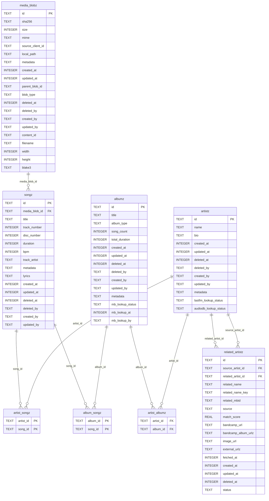
```mermaid
erDiagram
  media_blobz {
    TEXT id PK
    TEXT sha256
    INTEGER size
    TEXT mime
    TEXT source_client_id
    TEXT local_path
    TEXT metadata
    INTEGER created_at
    INTEGER updated_at
    TEXT parent_blob_id
    TEXT blob_type
    INTEGER deleted_at
    TEXT deleted_by
    TEXT created_by
    TEXT updated_by
    TEXT content_id
    TEXT filename
    INTEGER width
    INTEGER height
    TEXT blake3
  }
  artistz {
    TEXT id PK
    TEXT name
    TEXT bio
    INTEGER created_at
    INTEGER updated_at
    INTEGER deleted_at
    TEXT deleted_by
    TEXT created_by
    TEXT updated_by
    TEXT metadata
    TEXT lastfm_lookup_status
    TEXT audiodb_lookup_status
  }
  albumz {
    TEXT id PK
    TEXT title
    TEXT album_type
    INTEGER song_count
    INTEGER total_duration
    INTEGER created_at
    INTEGER updated_at
    INTEGER deleted_at
    TEXT deleted_by
    TEXT created_by
    TEXT updated_by
    TEXT metadata
    TEXT mb_lookup_status
    INTEGER mb_lookup_at
    TEXT mb_lookup_by
  }
  songz {
    TEXT id PK
    TEXT media_blob_id FK
    TEXT title
    INTEGER track_number
    INTEGER disc_number
    INTEGER duration
    INTEGER bpm
    TEXT track_artist
    TEXT metadata
    TEXT lyrics
    INTEGER created_at
    INTEGER updated_at
    INTEGER deleted_at
    TEXT deleted_by
    TEXT created_by
    TEXT updated_by
  }
  artist_albumz {
    TEXT artist_id FK
    TEXT album_id FK
  }
  artist_songz {
    TEXT artist_id PK
    TEXT song_id PK
  }
  album_songz {
    TEXT album_id PK
    TEXT song_id PK
  }
  related_artistz {
    TEXT id PK
    TEXT source_artist_id FK
    TEXT related_artist_id FK
    TEXT related_name
    TEXT related_name_key
    TEXT related_mbid
    TEXT source
    REAL match_score
    TEXT bandcamp_url
    TEXT bandcamp_album_urlz
    TEXT image_url
    TEXT external_urlz
    INTEGER fetched_at
    INTEGER created_at
    INTEGER updated_at
    INTEGER deleted_at
    TEXT status
  }
  media_blobz ||--o{ songz : "media_blob_id"
  albumz ||--o{ artist_albumz : "album_id"
  artistz ||--o{ artist_albumz : "artist_id"
  songz ||--o{ artist_songz : "song_id"
  artistz ||--o{ artist_songz : "artist_id"
  songz ||--o{ album_songz : "song_id"
  albumz ||--o{ album_songz : "album_id"
  artistz ||--o{ related_artistz : "related_artist_id"
  artistz ||--o{ related_artistz : "source_artist_id"
```

#### taxonomy + tags

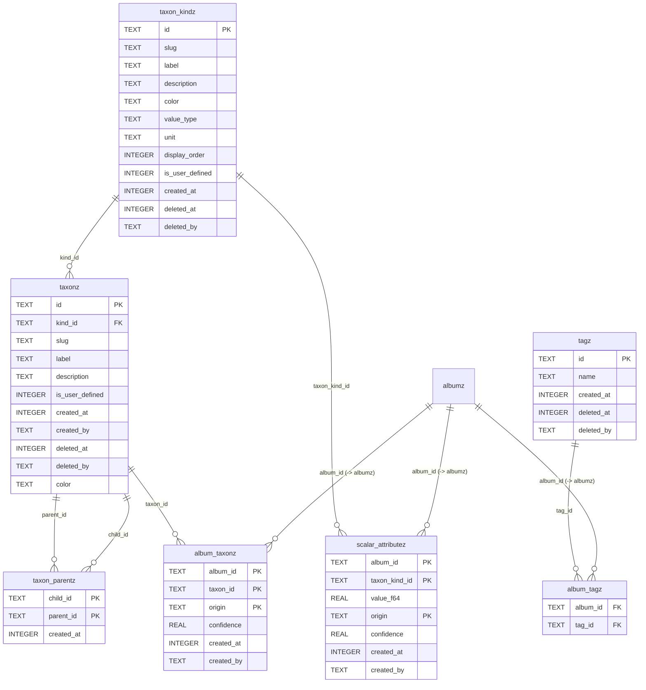
```mermaid
erDiagram
  tagz {
    TEXT id PK
    TEXT name
    INTEGER created_at
    INTEGER deleted_at
    TEXT deleted_by
  }
  album_tagz {
    TEXT album_id FK
    TEXT tag_id FK
  }
  taxon_kindz {
    TEXT id PK
    TEXT slug
    TEXT label
    TEXT description
    TEXT color
    TEXT value_type
    TEXT unit
    INTEGER display_order
    INTEGER is_user_defined
    INTEGER created_at
    INTEGER deleted_at
    TEXT deleted_by
  }
  taxonz {
    TEXT id PK
    TEXT kind_id FK
    TEXT slug
    TEXT label
    TEXT description
    INTEGER is_user_defined
    INTEGER created_at
    TEXT created_by
    INTEGER deleted_at
    TEXT deleted_by
    TEXT color
  }
  taxon_parentz {
    TEXT child_id PK
    TEXT parent_id PK
    INTEGER created_at
  }
  album_taxonz {
    TEXT album_id PK
    TEXT taxon_id PK
    TEXT origin PK
    REAL confidence
    INTEGER created_at
    TEXT created_by
  }
  scalar_attributez {
    TEXT album_id PK
    TEXT taxon_kind_id PK
    REAL value_f64
    TEXT origin PK
    REAL confidence
    INTEGER created_at
    TEXT created_by
  }
  tagz ||--o{ album_tagz : "tag_id"
  albumz ||--o{ album_tagz : "album_id (-> albumz)"
  taxon_kindz ||--o{ taxonz : "kind_id"
  taxonz ||--o{ taxon_parentz : "parent_id"
  taxonz ||--o{ taxon_parentz : "child_id"
  taxonz ||--o{ album_taxonz : "taxon_id"
  albumz ||--o{ album_taxonz : "album_id (-> albumz)"
  taxon_kindz ||--o{ scalar_attributez : "taxon_kind_id"
  albumz ||--o{ scalar_attributez : "album_id (-> albumz)"
```

#### playlists

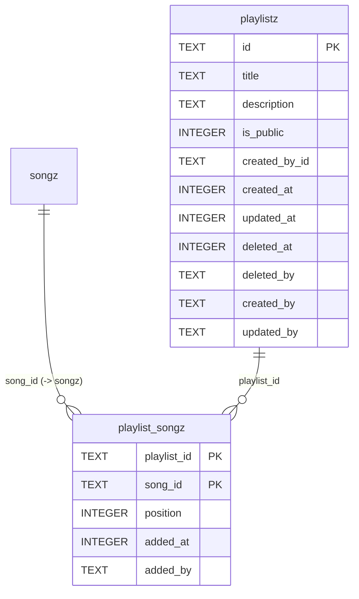
```mermaid
erDiagram
  playlistz {
    TEXT id PK
    TEXT title
    TEXT description
    INTEGER is_public
    TEXT created_by_id
    INTEGER created_at
    INTEGER updated_at
    INTEGER deleted_at
    TEXT deleted_by
    TEXT created_by
    TEXT updated_by
  }
  playlist_songz {
    TEXT playlist_id PK
    TEXT song_id PK
    INTEGER position
    INTEGER added_at
    TEXT added_by
  }
  songz ||--o{ playlist_songz : "song_id (-> songz)"
  playlistz ||--o{ playlist_songz : "playlist_id"
```

#### images + links

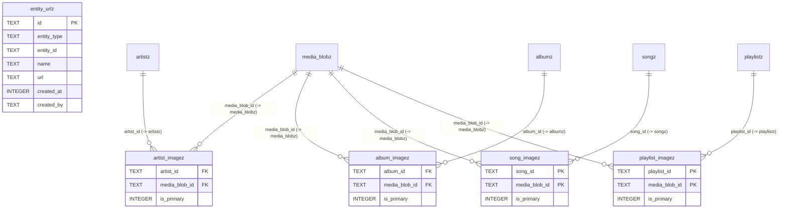
```mermaid
erDiagram
  artist_imagez {
    TEXT artist_id FK
    TEXT media_blob_id FK
    INTEGER is_primary
  }
  album_imagez {
    TEXT album_id FK
    TEXT media_blob_id FK
    INTEGER is_primary
  }
  song_imagez {
    TEXT song_id PK
    TEXT media_blob_id PK
    INTEGER is_primary
  }
  playlist_imagez {
    TEXT playlist_id PK
    TEXT media_blob_id PK
    INTEGER is_primary
  }
  entity_urlz {
    TEXT id PK
    TEXT entity_type
    TEXT entity_id
    TEXT name
    TEXT url
    INTEGER created_at
    TEXT created_by
  }
  media_blobz ||--o{ artist_imagez : "media_blob_id (-> media_blobz)"
  artistz ||--o{ artist_imagez : "artist_id (-> artistz)"
  media_blobz ||--o{ album_imagez : "media_blob_id (-> media_blobz)"
  albumz ||--o{ album_imagez : "album_id (-> albumz)"
  media_blobz ||--o{ song_imagez : "media_blob_id (-> media_blobz)"
  songz ||--o{ song_imagez : "song_id (-> songz)"
  media_blobz ||--o{ playlist_imagez : "media_blob_id (-> media_blobz)"
  playlistz ||--o{ playlist_imagez : "playlist_id (-> playlistz)"
```

#### users, auth + sessions

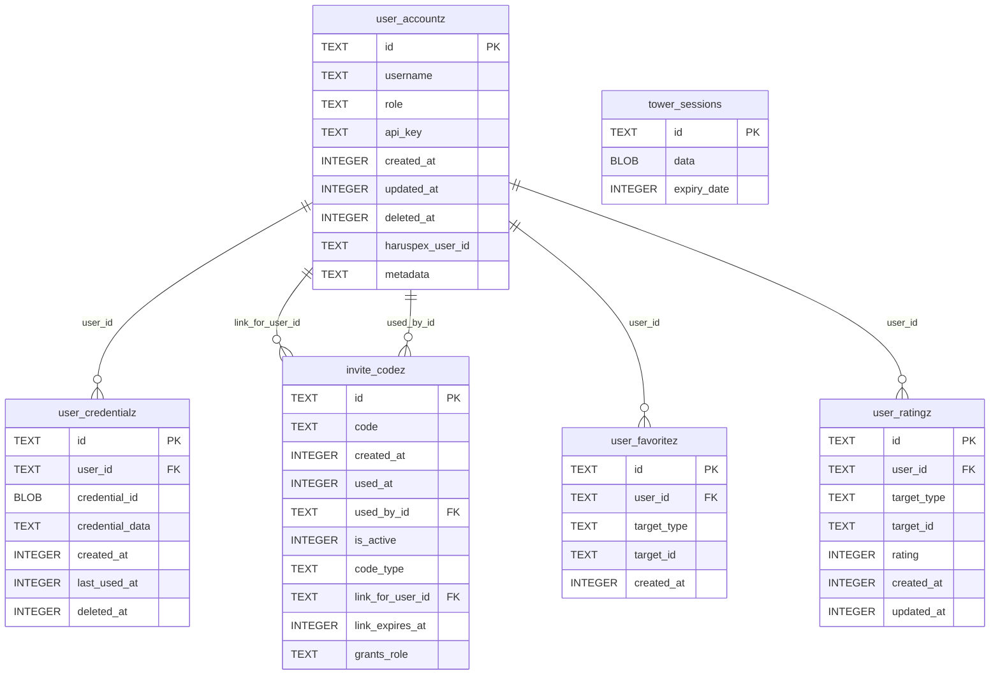
```mermaid
erDiagram
  user_accountz {
    TEXT id PK
    TEXT username
    TEXT role
    TEXT api_key
    INTEGER created_at
    INTEGER updated_at
    INTEGER deleted_at
    TEXT haruspex_user_id
    TEXT metadata
  }
  user_credentialz {
    TEXT id PK
    TEXT user_id FK
    BLOB credential_id
    TEXT credential_data
    INTEGER created_at
    INTEGER last_used_at
    INTEGER deleted_at
  }
  invite_codez {
    TEXT id PK
    TEXT code
    INTEGER created_at
    INTEGER used_at
    TEXT used_by_id FK
    INTEGER is_active
    TEXT code_type
    TEXT link_for_user_id FK
    INTEGER link_expires_at
    TEXT grants_role
  }
  user_favoritez {
    TEXT id PK
    TEXT user_id FK
    TEXT target_type
    TEXT target_id
    INTEGER created_at
  }
  user_ratingz {
    TEXT id PK
    TEXT user_id FK
    TEXT target_type
    TEXT target_id
    INTEGER rating
    INTEGER created_at
    INTEGER updated_at
  }
  tower_sessions {
    TEXT id PK
    BLOB data
    INTEGER expiry_date
  }
  user_accountz ||--o{ user_credentialz : "user_id"
  user_accountz ||--o{ invite_codez : "link_for_user_id"
  user_accountz ||--o{ invite_codez : "used_by_id"
  user_accountz ||--o{ user_favoritez : "user_id"
  user_accountz ||--o{ user_ratingz : "user_id"
```

#### radio

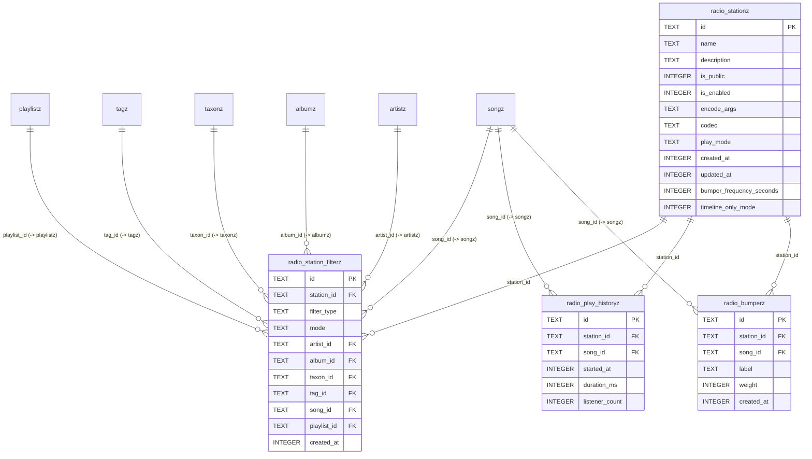
```mermaid
erDiagram
  radio_stationz {
    TEXT id PK
    TEXT name
    TEXT description
    INTEGER is_public
    INTEGER is_enabled
    TEXT encode_args
    TEXT codec
    TEXT play_mode
    INTEGER created_at
    INTEGER updated_at
    INTEGER bumper_frequency_seconds
    INTEGER timeline_only_mode
  }
  radio_station_filterz {
    TEXT id PK
    TEXT station_id FK
    TEXT filter_type
    TEXT mode
    TEXT artist_id FK
    TEXT album_id FK
    TEXT taxon_id FK
    TEXT tag_id FK
    TEXT song_id FK
    TEXT playlist_id FK
    INTEGER created_at
  }
  radio_play_historyz {
    TEXT id PK
    TEXT station_id FK
    TEXT song_id FK
    INTEGER started_at
    INTEGER duration_ms
    INTEGER listener_count
  }
  radio_bumperz {
    TEXT id PK
    TEXT station_id FK
    TEXT song_id FK
    TEXT label
    INTEGER weight
    INTEGER created_at
  }
  playlistz ||--o{ radio_station_filterz : "playlist_id (-> playlistz)"
  songz ||--o{ radio_station_filterz : "song_id (-> songz)"
  tagz ||--o{ radio_station_filterz : "tag_id (-> tagz)"
  taxonz ||--o{ radio_station_filterz : "taxon_id (-> taxonz)"
  albumz ||--o{ radio_station_filterz : "album_id (-> albumz)"
  artistz ||--o{ radio_station_filterz : "artist_id (-> artistz)"
  radio_stationz ||--o{ radio_station_filterz : "station_id"
  songz ||--o{ radio_play_historyz : "song_id (-> songz)"
  radio_stationz ||--o{ radio_play_historyz : "station_id"
  songz ||--o{ radio_bumperz : "song_id (-> songz)"
  radio_stationz ||--o{ radio_bumperz : "station_id"
```

#### listening + feed

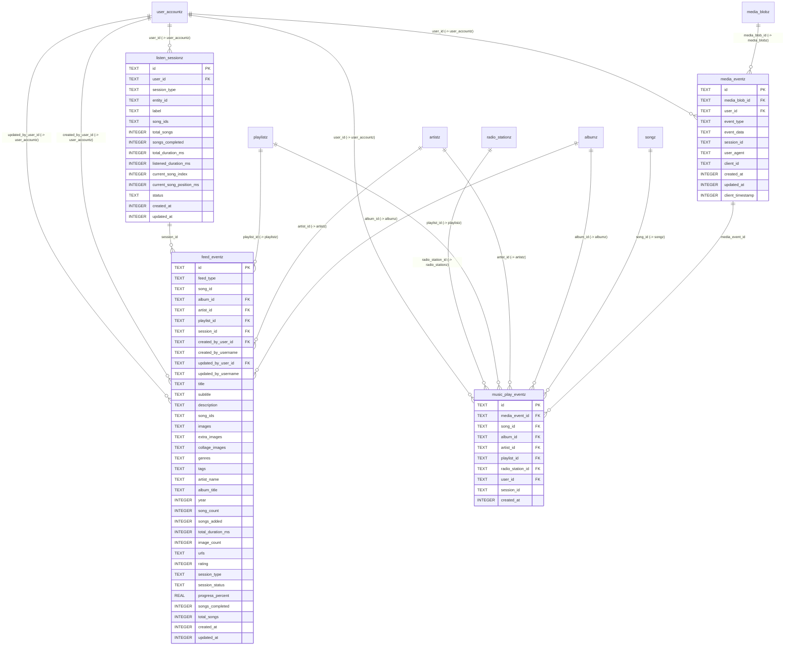
```mermaid
erDiagram
  listen_sessionz {
    TEXT id PK
    TEXT user_id FK
    TEXT session_type
    TEXT entity_id
    TEXT label
    TEXT song_ids
    INTEGER total_songs
    INTEGER songs_completed
    INTEGER total_duration_ms
    INTEGER listened_duration_ms
    INTEGER current_song_index
    INTEGER current_song_position_ms
    TEXT status
    INTEGER created_at
    INTEGER updated_at
  }
  music_play_eventz {
    TEXT id PK
    TEXT media_event_id FK
    TEXT song_id FK
    TEXT album_id FK
    TEXT artist_id FK
    TEXT playlist_id FK
    TEXT radio_station_id FK
    TEXT user_id FK
    TEXT session_id
    INTEGER created_at
  }
  media_eventz {
    TEXT id PK
    TEXT media_blob_id FK
    TEXT user_id FK
    TEXT event_type
    TEXT event_data
    TEXT session_id
    TEXT user_agent
    TEXT client_id
    INTEGER created_at
    INTEGER updated_at
    INTEGER client_timestamp
  }
  feed_eventz {
    TEXT id PK
    TEXT feed_type
    TEXT song_id
    TEXT album_id FK
    TEXT artist_id FK
    TEXT playlist_id FK
    TEXT session_id FK
    TEXT created_by_user_id FK
    TEXT created_by_username
    TEXT updated_by_user_id FK
    TEXT updated_by_username
    TEXT title
    TEXT subtitle
    TEXT description
    TEXT song_ids
    TEXT images
    TEXT extra_images
    TEXT collage_images
    TEXT genres
    TEXT tags
    TEXT artist_name
    TEXT album_title
    INTEGER year
    INTEGER song_count
    INTEGER songs_added
    INTEGER total_duration_ms
    INTEGER image_count
    TEXT urls
    INTEGER rating
    TEXT session_type
    TEXT session_status
    REAL progress_percent
    INTEGER songs_completed
    INTEGER total_songs
    INTEGER created_at
    INTEGER updated_at
  }
  user_accountz ||--o{ listen_sessionz : "user_id (-> user_accountz)"
  user_accountz ||--o{ music_play_eventz : "user_id (-> user_accountz)"
  radio_stationz ||--o{ music_play_eventz : "radio_station_id (-> radio_stationz)"
  playlistz ||--o{ music_play_eventz : "playlist_id (-> playlistz)"
  artistz ||--o{ music_play_eventz : "artist_id (-> artistz)"
  albumz ||--o{ music_play_eventz : "album_id (-> albumz)"
  songz ||--o{ music_play_eventz : "song_id (-> songz)"
  media_eventz ||--o{ music_play_eventz : "media_event_id"
  user_accountz ||--o{ media_eventz : "user_id (-> user_accountz)"
  media_blobz ||--o{ media_eventz : "media_blob_id (-> media_blobz)"
  user_accountz ||--o{ feed_eventz : "updated_by_user_id (-> user_accountz)"
  user_accountz ||--o{ feed_eventz : "created_by_user_id (-> user_accountz)"
  listen_sessionz ||--o{ feed_eventz : "session_id"
  playlistz ||--o{ feed_eventz : "playlist_id (-> playlistz)"
  artistz ||--o{ feed_eventz : "artist_id (-> artistz)"
  albumz ||--o{ feed_eventz : "album_id (-> albumz)"
```

#### federation + p2p

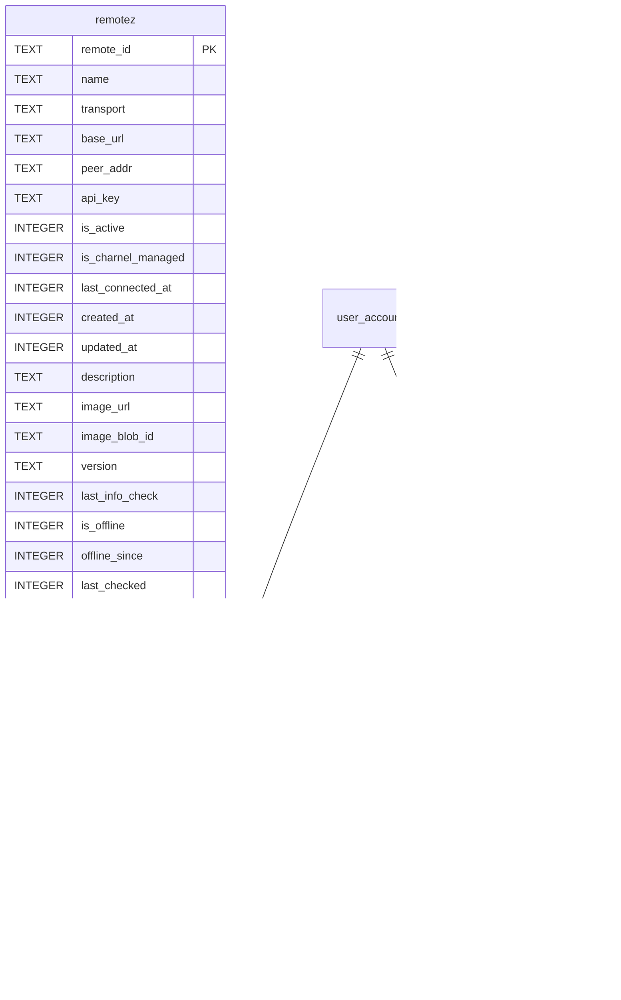
```mermaid
erDiagram
  remotez {
    TEXT remote_id PK
    TEXT name
    TEXT transport
    TEXT base_url
    TEXT peer_addr
    TEXT api_key
    INTEGER is_active
    INTEGER is_charnel_managed
    INTEGER last_connected_at
    INTEGER created_at
    INTEGER updated_at
    TEXT description
    TEXT image_url
    TEXT image_blob_id
    TEXT version
    INTEGER last_info_check
    INTEGER is_offline
    INTEGER offline_since
    INTEGER last_checked
    TEXT metadata
  }
  user_peer_nodez {
    TEXT user_id PK
    TEXT node_id PK
    TEXT instance_name
    TEXT metadata
    INTEGER created_at
    INTEGER last_seen_at
    INTEGER deleted_at
  }
  knock_requestz {
    TEXT id PK
    TEXT node_id
    TEXT username
    TEXT message
    TEXT status
    INTEGER created_at
    INTEGER processed_at
    TEXT processed_by FK
  }
  user_accountz ||--o{ user_peer_nodez : "user_id (-> user_accountz)"
  user_accountz ||--o{ knock_requestz : "processed_by (-> user_accountz)"
```

#### scanning + jobs

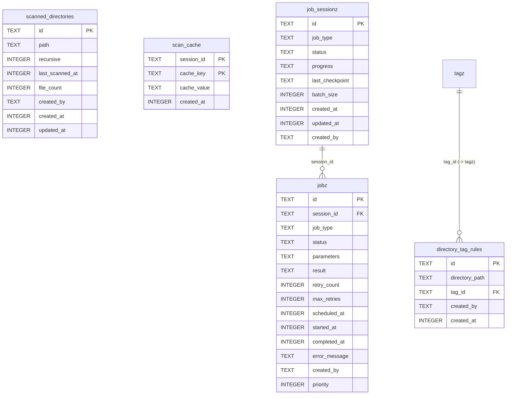
```mermaid
erDiagram
  scanned_directories {
    TEXT id PK
    TEXT path
    INTEGER recursive
    INTEGER last_scanned_at
    INTEGER file_count
    TEXT created_by
    INTEGER created_at
    INTEGER updated_at
  }
  directory_tag_rules {
    TEXT id PK
    TEXT directory_path
    TEXT tag_id FK
    TEXT created_by
    INTEGER created_at
  }
  scan_cache {
    TEXT session_id PK
    TEXT cache_key PK
    TEXT cache_value
    INTEGER created_at
  }
  jobz {
    TEXT id PK
    TEXT session_id FK
    TEXT job_type
    TEXT status
    TEXT parameters
    TEXT result
    INTEGER retry_count
    INTEGER max_retries
    INTEGER scheduled_at
    INTEGER started_at
    INTEGER completed_at
    TEXT error_message
    TEXT created_by
    INTEGER priority
  }
  job_sessionz {
    TEXT id PK
    TEXT job_type
    TEXT status
    TEXT progress
    TEXT last_checkpoint
    INTEGER batch_size
    INTEGER created_at
    INTEGER updated_at
    TEXT created_by
  }
  tagz ||--o{ directory_tag_rules : "tag_id (-> tagz)"
  job_sessionz ||--o{ jobz : "session_id"
```

_full-text search mirrors (FTS5): `albumz`, `artistz`, `playlistz`, `songz`, `taxonz` each have a companion `<table>_fts` virtual table kept in sync by triggers._

{/* gen:sqlite:end */}

---

## query views

the query views in `migrations/views/*.sql` do a lot of the read-side heavy lifting. each one denormalizes a fan-in of base tables (and sometimes upstream views) into a single wide row, so a list or detail endpoint reads from one view instead of stitching together a dozen joins on every request. they're dropped and recreated in dependency order on every connect, after migrations, so they always match the current schema.

a view itself has no parameters - it's just a stored `SELECT`. the "interface" lives in the grimoire repository functions that wrap each view: they bolt on `WHERE` filters, an `ORDER BY`, and `LIMIT`/`OFFSET`, then map the wide row into a domain struct. the diagrams below read left to right as **caller inputs -> the view -> the output row** it produces.

#### `artist_query_view`

one row per artist with images, url links, and album/song counts folded in.

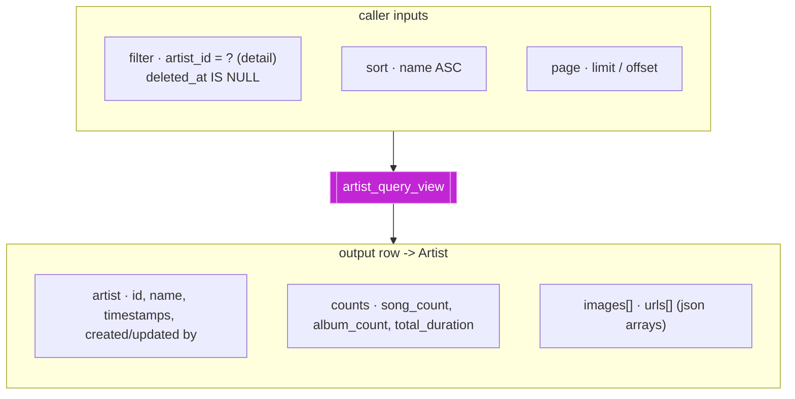
```mermaid
flowchart TB
  subgraph in["caller inputs"]
    direction TB
    f1["filter · artist_id = ? (detail)<br/>deleted_at IS NULL"]
    f2["sort · name ASC"]
    f3["page · limit / offset"]
  end
  v[["artist_query_view"]]
  subgraph out["output row -> Artist"]
    direction TB
    g1["artist · id, name, timestamps, created/updated by"]
    g2["counts · song_count, album_count, total_duration"]
    g3["images[] · urls[] (json arrays)"]
  end
  in --> v --> out
  classDef view fill:#c026d3,stroke:#f0abfc,color:#fff;
  class v view;
```

#### `album_query_view`

one row per album with synthesized genres, release date, label, tags, and cover art - the legacy column contract callers still expect.

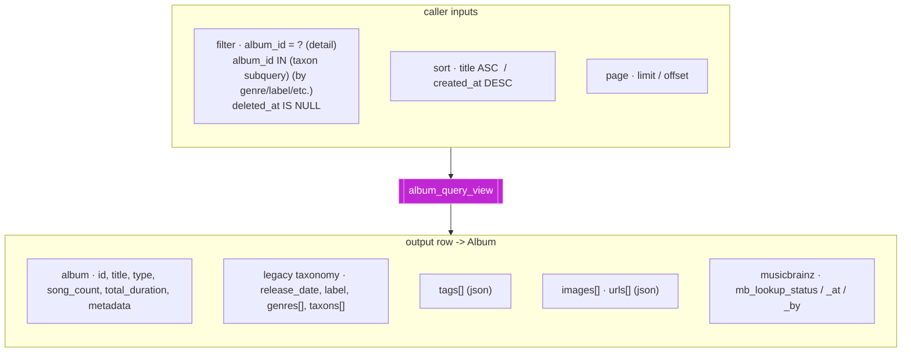
```mermaid
flowchart TB
  subgraph in["caller inputs"]
    direction TB
    f1["filter · album_id = ? (detail)<br/>album_id IN (taxon subquery) (by genre/label/etc.)<br/>deleted_at IS NULL"]
    f2["sort · title ASC  /  created_at DESC"]
    f3["page · limit / offset"]
  end
  v[["album_query_view"]]
  subgraph out["output row -> Album"]
    direction TB
    g1["album · id, title, type, song_count, total_duration, metadata"]
    g2["legacy taxonomy · release_date, label, genres[], taxons[]"]
    g3["tags[] (json)"]
    g4["images[] · urls[] (json)"]
    g5["musicbrainz · mb_lookup_status / _at / _by"]
  end
  in --> v --> out
  classDef view fill:#c026d3,stroke:#f0abfc,color:#fff;
  class v view;
```

#### `song_query_view`

the workhorse: a fully-denormalized song row carrying its album, artist, taxonomy, images, and play counts so list endpoints avoid a pile of joins. reads the upstream `artist_query_view` for artist stats.

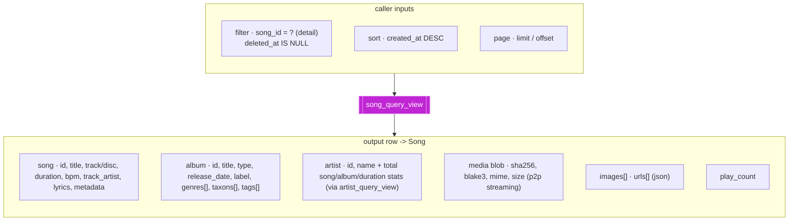
```mermaid
flowchart TB
  subgraph in["caller inputs"]
    direction TB
    f1["filter · song_id = ? (detail)<br/>deleted_at IS NULL"]
    f2["sort · created_at DESC"]
    f3["page · limit / offset"]
  end
  v[["song_query_view"]]
  subgraph out["output row -> Song"]
    direction TB
    g1["song · id, title, track/disc, duration, bpm, track_artist, lyrics, metadata"]
    g2["album · id, title, type, release_date, label, genres[], taxons[], tags[]"]
    g3["artist · id, name + total song/album/duration stats (via artist_query_view)"]
    g4["media blob · sha256, blake3, mime, size (p2p streaming)"]
    g5["images[] · urls[] (json)"]
    g6["play_count"]
  end
  in --> v --> out
  classDef view fill:#c026d3,stroke:#f0abfc,color:#fff;
  class v view;
```

#### `playlist_query_view`

one row per playlist with cover art, url links, and aggregate counts.

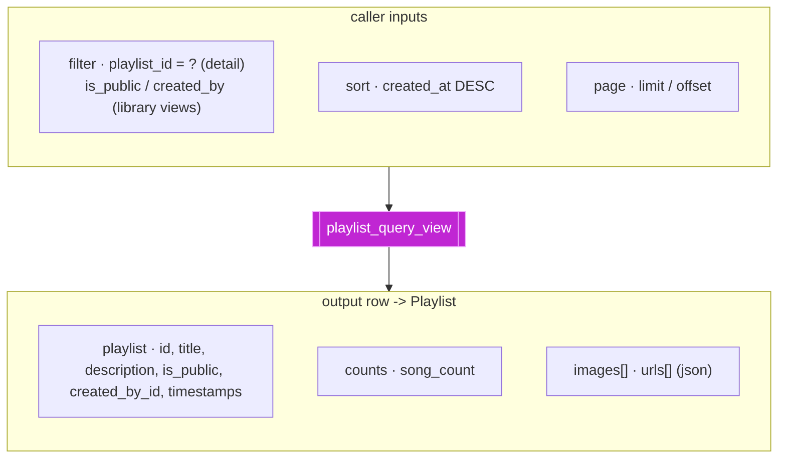
```mermaid
flowchart TB
  subgraph in["caller inputs"]
    direction TB
    f1["filter · playlist_id = ? (detail)<br/>is_public / created_by (library views)"]
    f2["sort · created_at DESC"]
    f3["page · limit / offset"]
  end
  v[["playlist_query_view"]]
  subgraph out["output row -> Playlist"]
    direction TB
    g1["playlist · id, title, description, is_public, created_by_id, timestamps"]
    g2["counts · song_count"]
    g3["images[] · urls[] (json)"]
  end
  in --> v --> out
  classDef view fill:#c026d3,stroke:#f0abfc,color:#fff;
  class v view;
```

#### `playlist_song_query_view`

playlist membership joined to the full song row, so a playlist renders from a single read. carries every `song_query_view` column plus the membership position.

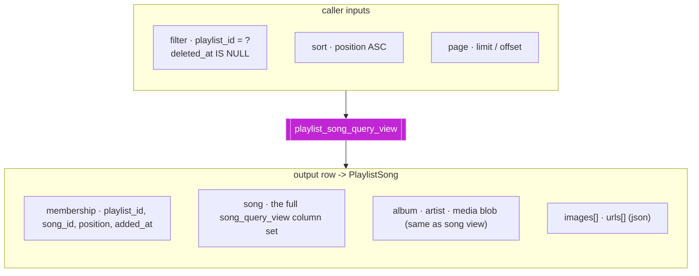
```mermaid
flowchart TB
  subgraph in["caller inputs"]
    direction TB
    f1["filter · playlist_id = ?<br/>deleted_at IS NULL"]
    f2["sort · position ASC"]
    f3["page · limit / offset"]
  end
  v[["playlist_song_query_view"]]
  subgraph out["output row -> PlaylistSong"]
    direction TB
    g1["membership · playlist_id, song_id, position, added_at"]
    g2["song · the full song_query_view column set"]
    g3["album · artist · media blob (same as song view)"]
    g4["images[] · urls[] (json)"]
  end
  in --> v --> out
  classDef view fill:#c026d3,stroke:#f0abfc,color:#fff;
  class v view;
```

#### `feed_query_view`

the activity feed: unions listen sessions and entity changes into one ordered stream with display fields baked in.

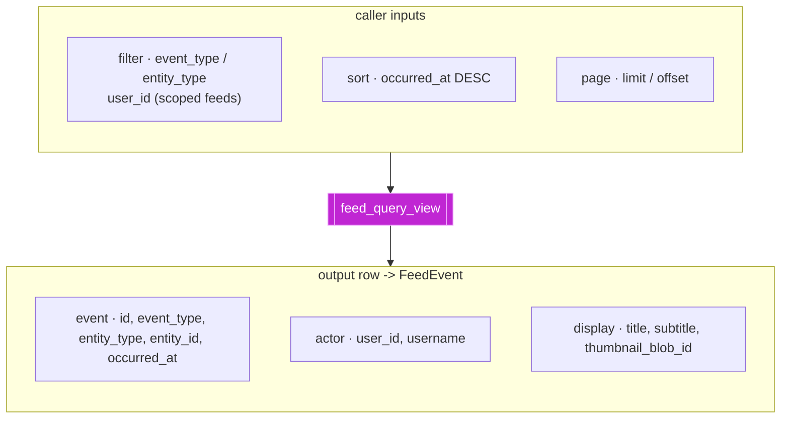
```mermaid
flowchart TB
  subgraph in["caller inputs"]
    direction TB
    f1["filter · event_type / entity_type<br/>user_id (scoped feeds)"]
    f2["sort · occurred_at DESC"]
    f3["page · limit / offset"]
  end
  v[["feed_query_view"]]
  subgraph out["output row -> FeedEvent"]
    direction TB
    g1["event · id, event_type, entity_type, entity_id, occurred_at"]
    g2["actor · user_id, username"]
    g3["display · title, subtitle, thumbnail_blob_id"]
  end
  in --> v --> out
  classDef view fill:#c026d3,stroke:#f0abfc,color:#fff;
  class v view;
```

---

## in the browser: IndexedDB

the spume web client uses three separate IndexedDB databases (via the [`idb`](https://www.npmjs.com/package/idb) library):

- **`freqhole_app`** — app/session state: the play queue, configured remotes, listen history, analytics events.
- **`freqhole_music`** — the cached music catalog: artists, albums, songs, playlists, tags, taxonomy, plus per-user favorites and ratings.
- **`freqhole_blobs`** — metadata for locally-stored images and audio. the actual bytes live in OPFS or the Cache API, not in IndexedDB.

unlike SQLite, IndexedDB has no foreign keys - stores reference each other by id at the application layer. in the diagrams below each store lists its key path (`PK`) and its indexes (`UK` marks a unique index); the relationship lines reflect the id fields the app joins on. `freqhole_music` is split into a few diagrams (catalog, playlists, tags + taxonomy, user library) so each stays readable; a relationship pointing at a store in another group is annotated `(-> store)`.

{/* gen:indexeddb:start */}

#### `freqhole_app` (v8)

```mermaid
erDiagram
  app_state {
    key id PK "id"
  }
  remotes {
    key remote_id PK "remote_id"
    index by_name "name"
    index by_is_active "is_active"
    index by_created_at "created_at"
  }
  queue_history {
    key id PK "id"
    index by_queued_at "queued_at"
  }
  analytics_events {
    key id PK "id"
    index by_status "status"
    index by_created_at "created_at"
  }
  pending_remotes {
    key id PK "id"
    index by_peer_addr "peer_addr"
    index by_stage "stage"
    index by_created_at "created_at"
  }
  radio_history {
    key id PK "id"
    index by_played_at "played_at"
    index by_station_id "station_id"
  }
  shared_items {
    key id PK "id"
    index by_last_seen_at "last_seen_at"
    index by_kind "kind"
  }
```

#### `freqhole_music` · catalog (v13)

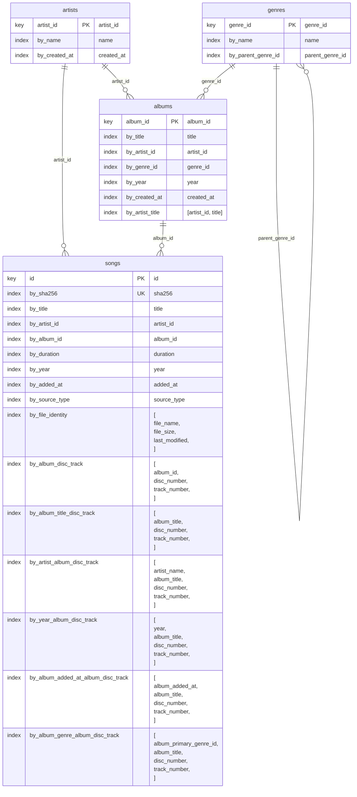
```mermaid
erDiagram
  artists {
    key artist_id PK "artist_id"
    index by_name "name"
    index by_created_at "created_at"
  }
  albums {
    key album_id PK "album_id"
    index by_title "title"
    index by_artist_id "artist_id"
    index by_genre_id "genre_id"
    index by_year "year"
    index by_created_at "created_at"
    index by_artist_title "[artist_id, title]"
  }
  songs {
    key id PK "id"
    index by_sha256 UK "sha256"
    index by_title "title"
    index by_artist_id "artist_id"
    index by_album_id "album_id"
    index by_duration "duration"
    index by_year "year"
    index by_added_at "added_at"
    index by_source_type "source_type"
    index by_file_identity "[
          file_name,
          file_size,
          last_modified,
        ]"
    index by_album_disc_track "[
          album_id,
          disc_number,
          track_number,
        ]"
    index by_album_title_disc_track "[
          album_title,
          disc_number,
          track_number,
        ]"
    index by_artist_album_disc_track "[
          artist_name,
          album_title,
          disc_number,
          track_number,
        ]"
    index by_year_album_disc_track "[
          year,
          album_title,
          disc_number,
          track_number,
        ]"
    index by_album_added_at_album_disc_track "[
          album_added_at,
          album_title,
          disc_number,
          track_number,
        ]"
    index by_album_genre_album_disc_track "[
          album_primary_genre_id,
          album_title,
          disc_number,
          track_number,
        ]"
  }
  genres {
    key genre_id PK "genre_id"
    index by_name "name"
    index by_parent_genre_id "parent_genre_id"
  }
  artists ||--o{ albums : "artist_id"
  artists ||--o{ songs : "artist_id"
  albums ||--o{ songs : "album_id"
  genres ||--o{ albums : "genre_id"
  genres ||--o{ genres : "parent_genre_id"
```

#### `freqhole_music` · playlists (v13)

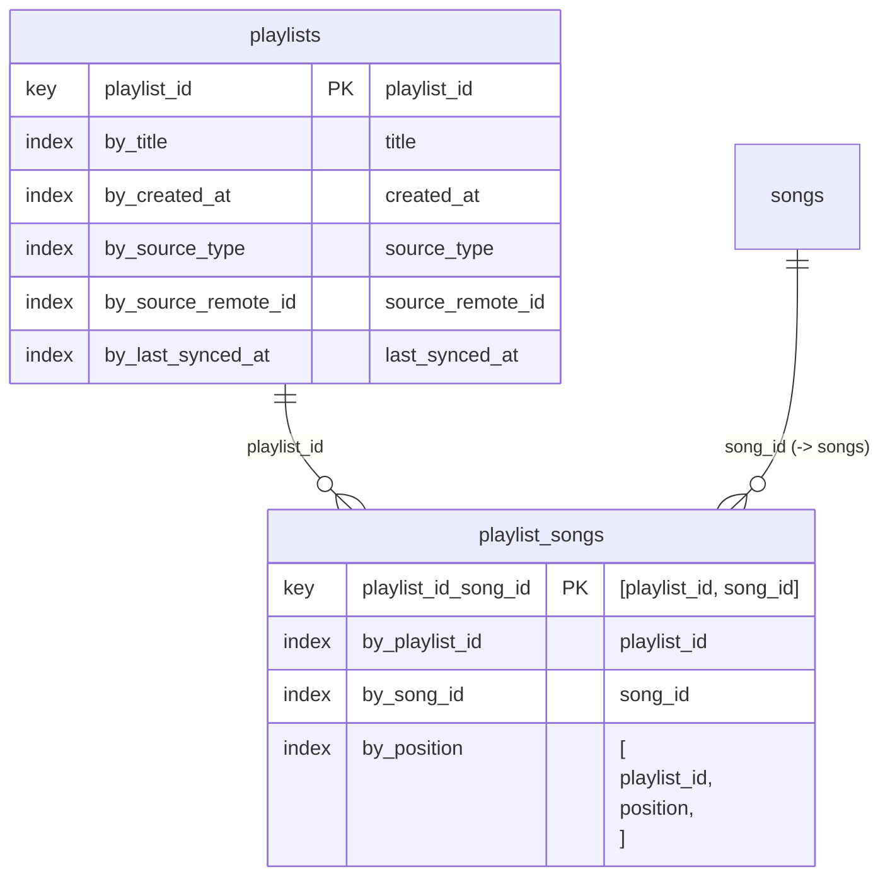
```mermaid
erDiagram
  playlists {
    key playlist_id PK "playlist_id"
    index by_title "title"
    index by_created_at "created_at"
    index by_source_type "source_type"
    index by_source_remote_id "source_remote_id"
    index by_last_synced_at "last_synced_at"
  }
  playlist_songs {
    key playlist_id_song_id PK "[playlist_id, song_id]"
    index by_playlist_id "playlist_id"
    index by_song_id "song_id"
    index by_position "[
          playlist_id,
          position,
        ]"
  }
  playlists ||--o{ playlist_songs : "playlist_id"
  songs ||--o{ playlist_songs : "song_id (-> songs)"
```

#### `freqhole_music` · tags + taxonomy (v13)

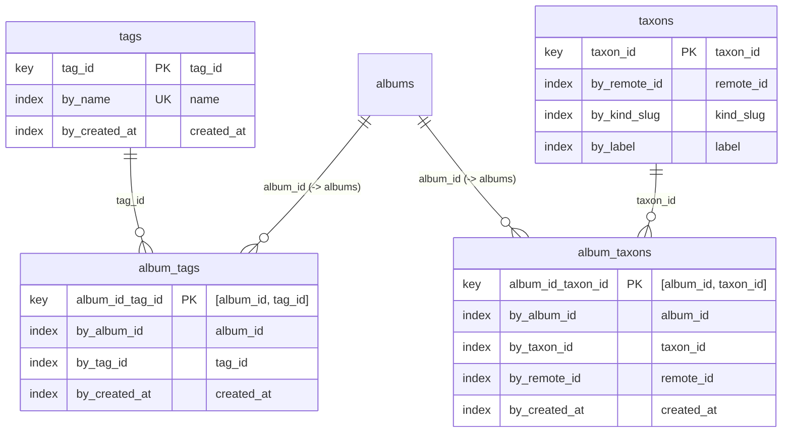
```mermaid
erDiagram
  tags {
    key tag_id PK "tag_id"
    index by_name UK "name"
    index by_created_at "created_at"
  }
  album_tags {
    key album_id_tag_id PK "[album_id, tag_id]"
    index by_album_id "album_id"
    index by_tag_id "tag_id"
    index by_created_at "created_at"
  }
  taxons {
    key taxon_id PK "taxon_id"
    index by_remote_id "remote_id"
    index by_kind_slug "kind_slug"
    index by_label "label"
  }
  album_taxons {
    key album_id_taxon_id PK "[album_id, taxon_id]"
    index by_album_id "album_id"
    index by_taxon_id "taxon_id"
    index by_remote_id "remote_id"
    index by_created_at "created_at"
  }
  albums ||--o{ album_tags : "album_id (-> albums)"
  tags ||--o{ album_tags : "tag_id"
  albums ||--o{ album_taxons : "album_id (-> albums)"
  taxons ||--o{ album_taxons : "taxon_id"
```

#### `freqhole_music` · user library (v13)

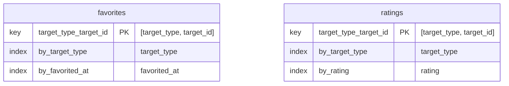
```mermaid
erDiagram
  favorites {
    key target_type_target_id PK "[target_type, target_id]"
    index by_target_type "target_type"
    index by_favorited_at "favorited_at"
  }
  ratings {
    key target_type_target_id PK "[target_type, target_id]"
    index by_target_type "target_type"
    index by_rating "rating"
  }
```

#### `freqhole_blobs` (v1)

```mermaid
erDiagram
  blobs {
    key blob_id PK "blob_id"
  }
```

{/* gen:indexeddb:end */}
