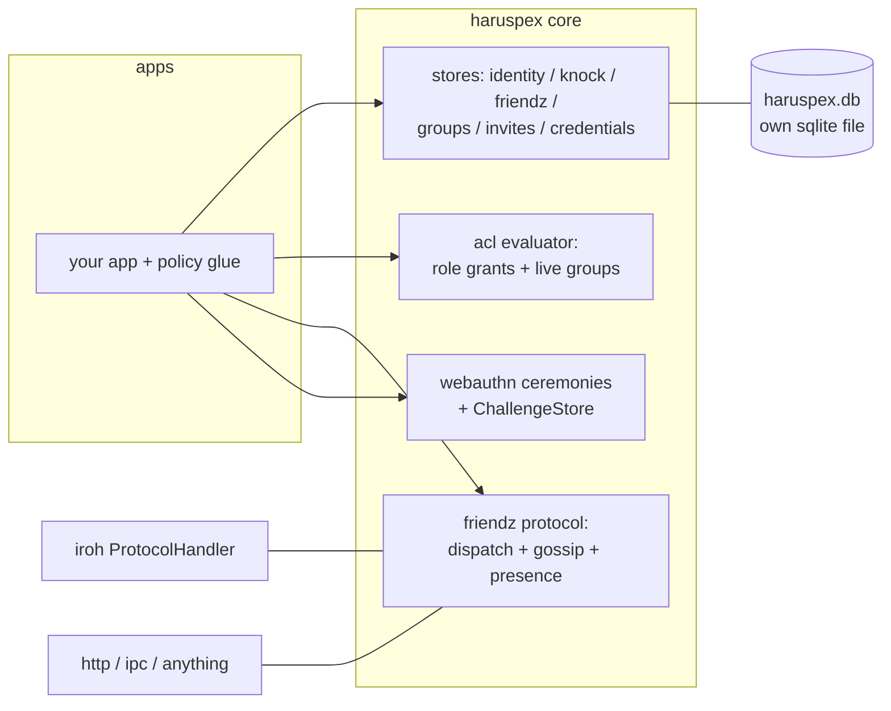

# haruspex

everything auth for the freqhole world of apps: webauthn passkeys, knock access requests,
user identity with multi-device node ids, roles + groups, api keys + invite codes, an acl
evaluator, and the friendz peer protocol (presence, gossip, friend requests). rust crate
`haruspex` + npm package `@freqhole/haruspex`.

## architecture

protocol logic is transport-agnostic: it takes (caller identity, message) and returns
responses. iroh p2p, http, or ipc bindings are thin shells around the same core. this is a
decentralized, peer-to-peer system - peers talk to peers; some are always-on, some ephemeral.



- each library owns its OWN sqlite db file (`haruspex.db`) - never tables inside a host
  app's db. cross-domain joins are an app concern (batch resolvers provided).
- apps extend the wire protocol with namespaced `AppExtension` messages (`myapp:thing`)
  without forking this repo.

## structure

```
rust/               crate: haruspex
  src/
    identity/       users, device node ids, attestation
    stores/         store traits + sqlite impls (identity, knock, friendz, groups, invites, credentials)
    acl/            evaluator: role grants, live groups, resource ancestry, RoleResolver seam
    knock/          knock lifecycle + KnockPolicy trait
    webauthn/       ceremony handlers (feature: webauthn)
    protocol/       friendz messages, codec, FriendzService, gossip; iroh shell (feature: iroh)
    sqlite/         pool open/migrations
    testing/        fixtures + fake stores (feature: test-utils)
  examples/         runnable walkthroughs (see below)
  fixtures/         committed protocol wire fixtures (shared with ts)
ts/                 npm: @freqhole/haruspex
  src/{identity,webauthn,knock,share,flows,protocol,permissions,state,solid,testing}
docs/               design notes specific to this repo
```

## rust: getting started

```rust
use haruspex::stores::IdentityStore;
use haruspex::testing::{identity_store, open_in_memory};

let pool = open_in_memory().await;           // or sqlite::open(path) in an app
let identities = identity_store(&pool);
let alice = identities.upsert_identity(/* Identity { .. } */).await?;
identities.add_device(/* DeviceNode { node_id, .. } */).await?;
```

features: `webauthn` (passkey ceremonies), `iroh` (friendz ProtocolHandler), `test-utils`
(in-memory fixtures). default = none of them - the core is dependency-light.

examples (each runnable, each a tiny tour):

```bash
cargo run --example identity-lifecycle --features test-utils   # identity + devices + attestation
cargo run --example acl-roles --features test-utils            # grants, groups, evaluator
cargo run --example role-backfill --features test-utils        # legacy role column -> grants
cargo run --example knock-exchange --features test-utils       # knock lifecycle + policy
cargo run --example two-peer-knock-iroh --features "iroh test-utils"  # real iroh, two endpoints
```

## ts: getting started

framework-free core subpaths; `solid-js` is an optional peer dep used only by `./solid`.

| subpath         | what                                                                         |
| --------------- | ---------------------------------------------------------------------------- |
| `./identity`    | P2PIdentity, idb store, cross-app resolution, web-locks leadership           |
| `./webauthn`    | credential codecs + transport-injected ceremony runners                      |
| `./knock`       | knock requester/responder state machines over idb stores                     |
| `./share`       | share-token codec + peer-address parsing/detection                           |
| `./flows`       | headless add-peer FSM (send(event) -> effects)                               |
| `./protocol`    | friendz zod schemas + codec + FriendzClient (fixture-validated against rust) |
| `./permissions` | role-hierarchy logic over an injected role table                             |
| `./state`       | peer-names, endpoint-control (framework-free singletons)                     |
| `./solid`       | solid-js components/signals (optional)                                       |
| `./testing`     | fixtures + fakes for consumer test suites                                    |

```ts
import {
  resolveIdentity,
  createIdbIdentityStore,
} from "@freqhole/haruspex/identity";
import { sendKnock, createIdbKnockStore } from "@freqhole/haruspex/knock";
// stores get their OWN idb database name - never your app's main db
```

## developer quick start

```bash
# rust
cargo test --workspace --all-features
cargo fmt --all --check && cargo clippy --workspace --all-targets

# ts
cd ts && npm i
npm run typecheck && npm test && npm run build
```

the crate owns its own sqlite db (`haruspex.db`); compiling needs no database (see
`rust/src/sqlite/mod.rs`). consumers today: tomb/grimoire (auth storage + evaluator),
tomb/spume (identity, webauthn), playlistz (knock, share), skein (friendz/peer stores) -
via path/git deps (rust) and `file:` deps (ts), no registry publishing yet.

see [docs/](docs/) for design notes; the canonical refactor plan lives in
tomb/docs/xl-refactor/.
