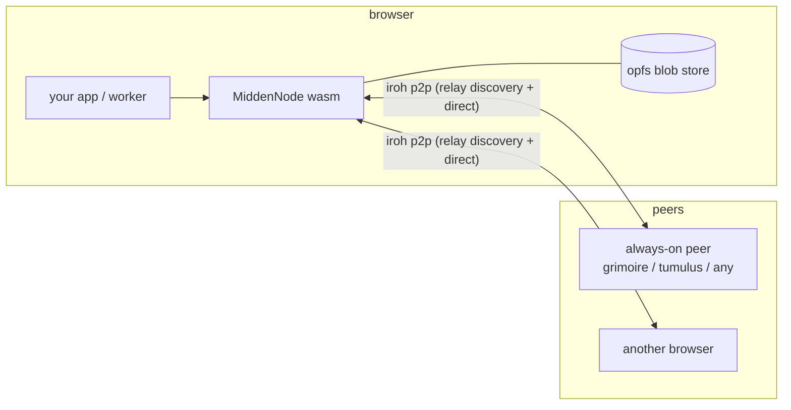

# midden

the unified wasm iroh node for the freqhole world of apps: a `MiddenNode` class that lets
browsers talk to freqhole peers over iroh p2p - api requests, verified blob streaming,
opfs-backed persistent blob storage, chunked import sessions, radio, and raw bidirectional
streams for app protocols. rust crate built with wasm-bindgen/wasm-pack; npm package
`@freqhole/midden`.

## architecture



the default registered ALPN set is the app-neutral base (`freqhole/1`, automerge sync,
friendz, admin, events, iroh-blobs). app-specific ALPNs are passed via `extra_alpns` -
never hardcoded here.

## structure

```
src/
  lib.rs           MiddenNode + options, bi-streams, blob transfer, import sessions
  opfs_store/      persistent browser blob store (storage-generic core, native tests)
  radio.rs         radio streaming
pkg/               committed wasm-pack output - consumers file:-dep straight at it
Makefile           build targets
```

`pkg/` is checked into git: rebuild it whenever `src/` changes or consumers won't see the
change.

## getting started

```typescript
import { MiddenNode, MiddenNodeOptions } from "@freqhole/midden";

const options = new MiddenNodeOptions();
options.set_secret_key(mySecretKeyBytes); // omit to generate fresh
options.set_opfs_store_dir("myapp-blobs"); // persistent blob store
options.set_extra_alpns(["myapp/1"]); // app protocol ALPNs
const node = await MiddenNode.create_with_options(options);
console.log("node id:", node.node_id());

// request/response to a peer (json over iroh; same dispatch shape as http)
const resp = await node.api_request(peerAddr, "GET", "/api/hello", null);

// verified blob download with progress
const bytes = await node.download_verified_with_ensure_progress(
  peerAddr,
  blake3Hash,
  totalSize,
  (fraction) => {},
  downloadId,
);

// raw bidirectional stream for your own protocol
const stream = await node.open_bi(peerAddr, "myapp/1");
await stream.write_raw_and_finish(encodedRequest);
const reply = await stream.read_to_end(64 * 1024);
```

`peer_addr` accepts a bare 64-hex node id (relay discovery) or a full endpoint json
(`{"id":"...","addrs":[...]}` with relay/ip hints).

other surface: `import_blob`/`release_blob` (stage bytes for peers), `ImportSession`
(chunked streaming import with incremental blake3), `Blake3Hasher`, `CancelToken` +
`download_cancel` (pause/resume), `protect_blob`/`unprotect_blob` (gc pins),
`has_complete_blob`, opfs selftests, radio.

## developer quick start

```bash
cargo install wasm-pack
brew install llvm          # macos: wasm toolchain needs it

make build                 # dev build -> pkg/
make build-release         # optimized
cargo test                 # native tests (opfs_store core runs without a browser)
```

consumers today: tomb/spume + rathole, skein/loam, playlistz - all via `file:` deps at
`pkg/` (e.g. `file:../../midden/pkg`). vite consumers bundling this inside a worker need
the resolveId-plugin pattern (see @freqhole/reliquary's README).

## protocol

same wire protocol as grimoire's federation transport: ALPN `freqhole/1`, messages
`ApiRequest`/`ApiResponse`, `EnsureBlobRequest`/`EnsureBlobResponse`, blob streaming as a
length-prefixed header + raw bytes. see `grimoire/src/federation/transport/protocol.rs`.

---

made with 💖 in NYC
