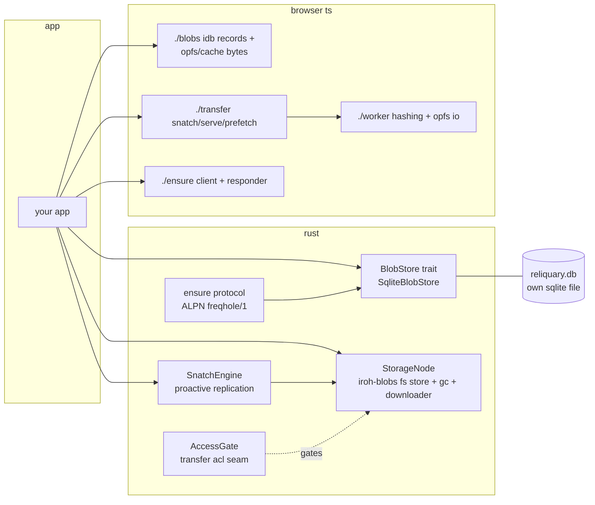

# reliquary

everything media blob storage for the freqhole world of apps: content-addressed blob stores
(sqlite-native and indexeddb/opfs-browser), iroh-blobs wrappers (fs store lifecycle, gc
protection, verified transfer), the snatch engine (proactive blob replication), the ensure
protocol (ask a peer to stage a blob), blob acl gating, media helpers, and shared browser
utils. rust crate `reliquary` + npm package `@freqhole/reliquary`.

## architecture

blake3 is the canonical content address everywhere (sha256 kept only as a legacy secondary
index). iroh p2p is a transport, not the architecture - the store contracts and transfer
flows are transport-injected. this library never owns an http server: range serving stays in
the consuming app.



## structure

```
rust/               crate: reliquary
  src/
    blobz.rs        BlobStore trait + sqlite impl (blake3 pk, soft delete, derived blobs)
    node.rs         StorageNode: fs store lifecycle, init_local/attach_endpoint, gc protect
    snatch.rs       SnatchEngine over BlobRefSource + PeerProbeTransport traits
    ensure.rs       EnsureBlobHandler + PeerMessage wire types (ALPN "freqhole/1")
    gate.rs         AccessGate seam for the iroh-blobs verified-transfer ALPN
    hash.rs         streaming blake3 helpers
    media/          image resize/webp (feature: media), pdf/video thumbs (feature: thumbnails)
    chunked_import.rs, identity.rs, db.rs
    testing.rs      fixtures (feature: test-utils)
  examples/         runnable walkthroughs (see below)
  migrations/       reliquary.db's own migration set
ts/                 npm: @freqhole/reliquary
  src/{blobs,transfer,ensure,worker,automerge,utils,solid,testing}
docs/               storage-traits.md (the BlobStore contract design)
```

## rust: getting started

```rust
use reliquary::{BlobStore, NewBlobMeta};
use reliquary::testing::make_blobz_store;

let (store, _tmp) = make_blobz_store().await;
let record = store.insert(bytes, NewBlobMeta {
    filename: Some("example.txt".into()),
    mime: Some("text/plain".into()),
    ..Default::default()
}).await?;
let bytes_back = store.read_bytes(&record.blake3).await?;
```

features (all default except `thumbnails`/`test-utils`): `blobz`, `node`, `snatch`,
`ensure`, `gate`, `media`, `chunked_import`, `identity`.

```bash
cargo run --example blob-round-trip --features test-utils       # BlobStore contract, no network
cargo run --example blob-acl-gate --features test-utils         # AccessGate over transfer events
cargo run --example snatch-engine --features test-utils         # replication engine w/ mock transport
cargo run --example two-peer-blob-transfer --features test-utils  # real iroh, two endpoints
```

## ts: getting started

framework-free core subpaths; `solid-js` / `@automerge/automerge-repo` are optional peer
deps used only by `./solid` / `./automerge`.

| subpath       | what                                                                                                      |
| ------------- | --------------------------------------------------------------------------------------------------------- |
| `./blobs`     | idb record store + opfs/cache-api bytes, blake3 canonical (`createBlobStore`)                             |
| `./transfer`  | `snatchBlob`/`snatchBlobToDisk` (pause/resume, per-peer strategy fallthrough), `BlobServer`, `Prefetcher` |
| `./ensure`    | ensure-blob client + responder over any bi-stream (`DEFAULT_ENSURE_ALPN = "freqhole/1"`)                  |
| `./worker`    | blob worker (hashing, opfs io, chunked upload) + client facade                                            |
| `./automerge` | IrohNetworkAdapter + acl change-stripping wrapper                                                         |
| `./utils`     | image-utils, hash, tagged log                                                                             |
| `./solid`     | createTransferProgress, createBlobUrl, createDocStore (optional)                                          |
| `./testing`   | mock streams/nodes, wav + deterministic-bytes fixtures, idb harness                                       |

```ts
import { createBlobStore } from "@freqhole/reliquary/blobs";
const store = createBlobStore({
  dbName: "myapp-blobs",
  allowCacheFallback: false,
});
```

vite consumers: worker-bundled midden resolution needs a `resolveId` plugin in BOTH
`plugins` and `worker.plugins` (see skein/loam's `vite.config.ts`) - a plain
`resolve.alias` silently fails at runtime only.

## developer quick start

```bash
# rust (no DATABASE_URL needed - queries are runtime-checked)
cargo test --workspace --all-features
cargo fmt --all --check && cargo clippy --workspace --all-targets

# ts
cd ts && npm i
npm run typecheck && npm test && npm run build
```

the crate owns its own sqlite db (`reliquary.db`) at runtime, separate from any consuming
app's db. consumers today: skein (hub daemon + tauri + loam, full cutover), tomb/grimoire
(hash; storage seam in progress), playlistz (transfer/blobs adoption planned).

see [docs/storage-traits.md](docs/storage-traits.md) for the BlobStore contract design; the
canonical refactor plan lives in tomb/docs/xl-refactor/.
